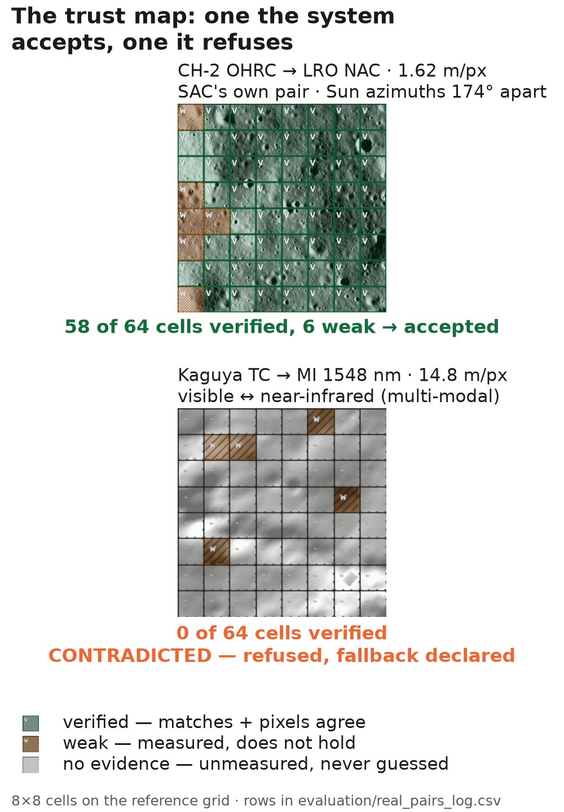
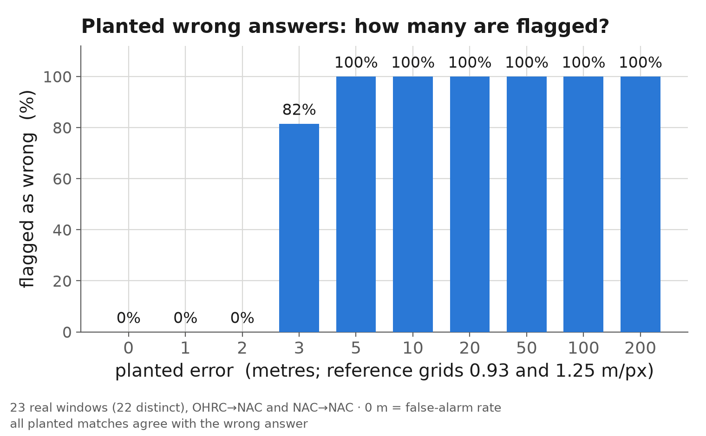
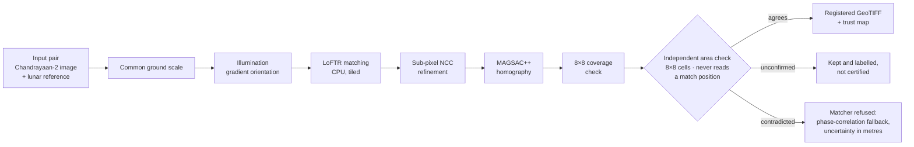
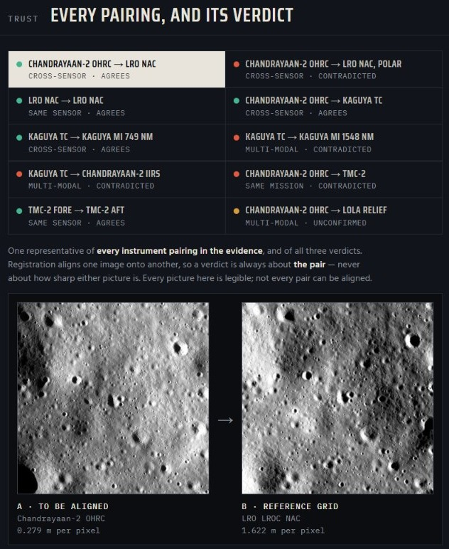

# Lunar image registration that knows when it is wrong

**Team LunaXX** · Smart India Hackathon 2026 · ISRO problem statement **SIH26166**:
*Multi-modal, Sun angle and scale invariant image correspondence using Chandrayaan-2 optical
images (OHRC, TMC and IIRS).*

[](LICENSE)


A registration method hands back a transform and a residual. On the Moon that is not enough.
Under a low or opposite Sun every shadow moves, and a matcher can fit six matches to a sub-pixel
residual while none of the matches it held back agree with the fit. The residual alone cannot
tell those two cases apart.

This pipeline registers a Chandrayaan-2 image onto a lunar reference and then **checks its own
answer with a test that never reads a match position**: it cross-correlates the warped image
against the reference in an 8×8 grid of cells, and each cell votes on the matcher's transform.
The result comes back with a verdict for the frame (accepted, unconfirmed or refused) and a map
of which regions it can vouch for. A refused result falls back to phase correlation and says
so, with its uncertainty in metres.

<p align="center">
  
</p>

Every result on this page is copied from [`REPORT.md`](REPORT.md), which is generated from the
evidence logs by one command and never edited by hand. Each row below names the REPORT.md
section it comes from.

---

## Results

Tested on 160 distinct ground windows and 8 instrument pairings of real Chandrayaan-2, LRO,
Kaguya and LOLA data, plus synthetic pairs with exact truth.

| Test | Result | REPORT.md section |
|---|---|---|
| **Sun angle:** SAC's own equatorial benchmark pair [1], OHRC → LRO NAC, Sun azimuths 174° apart, every shadow reversed | **6 of 6** windows accepted | *SAC's own benchmark pair (equatorial)* |
| **Sun angle:** SAC's polar benchmark pair [1] | 4 of 6 windows vouched for, 2 flagged | *SAC's own benchmark pair (polar)* |
| **Sun sweep:** one OHRC frame against 25 NAC frames, 69 windows, Sun azimuths 3.3–152.7° apart | **0** undetected failures | *Real sun-angle sweep* |
| **Whole overlap, not chosen windows:** one OHRC frame × one NAC at 74 °S, Suns 3.3° apart, every lit and textured 640-px window, 13.1 km² | **37 of 37** accepted; held-out median 0.61 px = 0.57 m on the 0.93 m NAC grid; 36 of 37 under 3 px | *The whole lit overlap of one OHRC frame with one NAC* |
| **Scale:** OHRC at 0.25 m onto Kaguya TC at 7.4 m (29.6×) | 3 of 4 accepted | *Scale rung* |
| **Sub-pixel, exact truth:** synthetic pairs rendered from LOLA, 60 m grid | 0.086 px = 5.1 m with the Suns 0–15° apart; 1.096 px = 65.8 m at 45° | *Sub-pixel accuracy, with the pixel grid named* |
| **Loop closure:** six three-image loops OHRC → NAC A → NAC B | close to 0.107 m on the 1.245 m NAC grid (consistency, not accuracy) | *Loop closure* |
| **Runtime** | median 8.2 s per 640-px window on a laptop CPU (89 OHRC → NAC windows) | *Runtime and match distribution* |

### Is the check itself any good?

A failure detector is only worth something if its false-alarm rate and its detection floor are
measured. We planted wrong answers of known size into 30 real windows, in two Sun populations
that are never pooled (*Trust layer on real imagery*):

- **no false alarm** in 44 correct trials with the Suns within 10°, or in 16 with them
  132–174° apart;
- **every 5 m error flagged** with the Suns within 10°, and every 10 m error with them 132–174°
  apart;
- below 2 m almost nothing is caught. That is the floor, and we report it.

<p align="center">
  
</p>

Errors that are not translations are why the verdict is per region. A rotation or scale change
about the centre leaves the centre still and moves the corners, so a frame-level verdict watches
the wrong place: at 3 m of corner displacement it refuses 0 of 120 trials, at 5 m only 15 of
120. Of the cells such an error moves past 2 px on the reference grid, the 8×8 map strips
verified state from 94 % (*Errors that are not translations*).

### What it refuses, and says so

| Case | What happens | REPORT.md section |
|---|---|---|
| Visible → near-infrared, Kaguya TC → MI 1548 nm | matcher refused on 3 of 3 windows; the declared fallback lands 3.4–16.2 m (0.23–1.09 px on MI's 14.8 m grid) from the visible-band registration of the same window | *Kaguya TC → Kaguya MI* |
| OHRC → TMC-2, Sun azimuths 120° apart | 6–7 inliers fitted to 0.13–0.96 px per axis in-sample on the 5.58 m TMC-2 grid, yet 0 % of held-out matches agree: refused on 4 of 4 | *SAC's benchmark site: OHRC → TMC-2 nadir* |
| IIRS near-infrared (89 m per pixel, 12× coarser) against Kaguya TC | 0 of 11 accepted when matched direct | *Kaguya TC → Chandrayaan-2 IIRS* |
| TMC-2 fore → aft (±25°): terrain relief is not a homography | 1 of 4 accepted | *Real viewpoint: TMC-2 fore → aft* |
| Sun vectors 90° or more apart (MiLOI [3]) | no method we ran registers any of the 16 pairs: ours, SIFT, ORB or AKAZE | *MiLOI* |
| Optical onto elevation, OHRC → LOLA shaded relief | a declared failure | *Declared-failure rung* |

The OHRC → TMC-2 pass above is the closest-Sun TMC-2 coverage of SAC's frame that we found in
PRADAN's footprint catalogue. Each refusal has a planned answer: re-pairing with the closest-Sun
reference in the archive, tile-level transforms with LOLA orthorectification for relief, and
IIRS matched through TMC-2 at an intermediate scale rather than straight onto TC.

---

## How it works



`core/pipeline.py` → `run_all()`, in the order it runs:

| Step | Module | What it does |
|---|---|---|
| 1 | `core/io_loader.py` | PDS4 (Chandrayaan-2), PDS3 (LRO, Kaguya) and GeoTIFF, read in windows |
| 2 | `core/scale.py` | both images to one ground scale, by area averaging |
| 3 | `core/illumination.py` | lighting reduced to gradient orientation |
| 4 | `core/matcher.py` | LoFTR [4] through kornia, on CPU, tiled |
| 5 | `core/subpixel.py` | NCC refinement of the matches, in original pixels |
| 6 | `core/ransac.py` | MAGSAC++ [5] (`cv2.USAC_MAGSAC`) |
| 7 | `evaluation/metrics.py` | the metrics, plus residuals on the 20 % of matches the fit never saw |
| 8 | `core/reliability.py` | the trust map and the area check, then the fallback when contradicted |
| 9 | `core/export.py` | the deliverables below |

**The trust layer** (`core/reliability.py`) is the contribution. A cell is `verified` only when
it holds at least 3 inliers, at least half of its raw matches survive MAGSAC++, and an FFT
cross-correlation of the warped image against the reference peaks within 2 px of zero at NCC
0.30 or more. A cell with no matches is `no_evidence`; it is never filled in by interpolation.
The frame `agrees` when at least half of the cells that can be measured agree with the
transform, and is `contradicted` below a quarter. The thresholds are design constants in that
file, and the prior art they build on is cited in its docstring [6–9].

**Deliverables**, for every pair, written to `--out DIR`:

- `registered_product.tif`, a GeoTIFF on the reference grid;
- `matches.csv`, every raw match with its inlier flag, residual and cell state;
- ground control points for GDAL (`-gcp`) and QGIS (`.points`);
- `matches_isis.csv`, an ISIS-style match list;
- `trust_map.csv`, the 8×8 cell states;
- `report.json` and `report.md`: metrics, timings, input sha256 and library versions.

<p align="center">
  
  <br/><sub>The Mission Console (<code>web/</code>): every instrument pairing, its verdict, and the two images aligned.</sub>
</p>

---

## Quick start

Python 3.12. No discrete GPU is needed or used; `requirements.txt` pulls the CPU build of PyTorch.

```
python -m venv .venv
.venv\Scripts\activate              # Windows;  source .venv/bin/activate elsewhere
pip install -r requirements.txt
python -m core.fetch_weights        # LoFTR weights into weights/, once (the only network step)
python -m pytest -q                 # the test suite; needs no imagery
```

Imagery is not in git. To register a real pair, download the products listed with their sha256
under *Products downloaded* in REPORT.md (Chandrayaan-2 from PRADAN; LRO from the NASA PDS;
Kaguya from JAXA), put their folder's path in `data_path.txt`, and cut pairs from them:

```
python -m ops.cut_pradan_pairs ohrc-nac              # SAC's equatorial OHRC -> LRO NAC pair
python -m ops.cut_site_pairs --help                  # OHRC -> NAC pairs at the 74 °S site
python -m core.pipeline data/pairs/sac_ohrc_nac_w01 --out out/sac_w01
```

Each pair folder records the product ids, grids, Sun geometry and the command that cut it in its
`geometry_prior.json`.

| Command | What it does |
|---|---|
| `streamlit run app/streamlit_app.py` | the demo app, offline, from cached results in `demo_cache/` |
| `python -m ops.precompute_demo_cache <pair> ...` | fill that cache for the pairs you name |
| `python -m web.build_console` | the Mission Console → `web/dist/index.html` (see `web/README.md`) |
| `python -m web.server` | the console plus a live bay that registers a pair you upload |
| `python -m ops.run_real_pairs "sac_ohrc_nac_w*" --log` | register pairs, export deliverables, append to the evidence log |
| `python -m ops.make_report` | regenerate REPORT.md from the logs |
| `python -m ops.freeze --plan` / `--check` | the evidence freeze: what would re-run / whether every row is from one commit |

---

## Reproducibility

No number is typed into REPORT.md. It is rendered from these logs:

| Log | Holds |
|---|---|
| `evaluation/real_pairs_log.csv` | every real pair: Sun geometry, window, archive offset, held-out and in-sample residuals, verdict, commit |
| `evaluation/trust_real_calibration.csv` | the planted wrong registrations, both Sun populations |
| `evaluation/miloi_log.csv`, `miloi_truth.json` | the MiLOI benchmark and its truth network |
| `evaluation/multimodal_check.csv` | the infrared fallback against the visible-band registration of the same window |
| `evaluation/results_log.csv` | every scored synthetic and baseline run |

`python -m ops.freeze` re-runs every piece of evidence on one clean commit, and `--check` reports
whether each logged row was measured at it. The real-pair rows were measured at freeze commit
`7dd4e5b`; REPORT.md's first lines name the commits it was generated from.

## Terminology we hold ourselves to

- **Cross-sensor** means different instruments. LRO NAC ↔ LRO NAC and TMC-2 fore ↔ aft are the
  *same sensor* and are tested as Sun-angle and viewpoint cases, never counted as cross-sensor.
- **Multi-modal** means visible ↔ infrared, radar or elevation. Two panchromatic cameras are not
  multi-modal.
- **Sub-pixel** always names its pixel grid and gives the metres.

## Repository layout

| Folder | Contents |
|---|---|
| `core/` | the pipeline modules above, plus `geometry` (map projections, NAC corrections) |
| `evaluation/` | metrics, synthetic and shaded-relief pairs, the real-pair evaluators, the evidence logs |
| `baselines/` | SIFT, ORB and AKAZE, and their sweeps |
| `app/` | `streamlit_app.py` (the demo) and `change_detection.py`, gated by the trust map |
| `web/` | the Mission Console: one self-contained page over the logged evidence, plus a local server with a live upload bay |
| `ops/` | pair cutting, runners, the freeze, the report generator, and the team's working notes and audits |
| `presentation/` | the pitch deck's builder (`build_deck.py`), its figures, and the numbers audit |
| `docs/` | definitions (`00_CANONICAL_FACTS.md`) and the team's module guides |

## References

1. Makharia, Singla, Amitabh, Dube, Sharma. Space Applications Centre (ISRO) and Manipal
   University Jaipur, 2025. [arXiv:2509.04775](https://arxiv.org/abs/2509.04775)
2. Singh, Singla, Hemrajani, Dube, Amitabh, Patel. *Towards Seamless Lunar Mosaics.* Space
   Applications Centre, 2026. [arXiv:2604.25208](https://arxiv.org/abs/2604.25208)
3. Xie, Liu, Di et al. *Remote Sensing* 17(13):2302, 2025 (MiLOI dataset).
4. Sun et al. *LoFTR: Detector-free local feature matching with transformers.* CVPR 2021.
   [arXiv:2104.00680](https://arxiv.org/abs/2104.00680)
5. Barath et al. *MAGSAC++.* CVPR 2020. [arXiv:1912.05909](https://arxiv.org/abs/1912.05909)
6. Uss, Vozel, Lukin, Chehdi. IEEE TGRS, 2016. [arXiv:1602.02720](https://arxiv.org/abs/1602.02720)
7. Brown and Lowe. *Automatic panoramic image stitching using invariant features.* IJCV 74(1), 2007.
8. Wan, Shao, Li, 2021. [arXiv:2106.12738](https://arxiv.org/abs/2106.12738)
9. Truong et al. *PDC-Net.* CVPR 2021. [arXiv:2101.01710](https://arxiv.org/abs/2101.01710)

**Data:** Chandrayaan-2 OHRC, TMC-2 and IIRS from ISRO's PRADAN (pradan.issdc.gov.in); LRO
LROC NAC and LOLA from the NASA Planetary Data System (public domain); SELENE (Kaguya) TC and MI
from JAXA; MiLOI from github.com/Bin501/CNSFM, used for evaluation only. None of it is
redistributed here.

## Licence

Apache License 2.0 - see [`LICENSE`](LICENSE). Third-party software and data are listed in
[`NOTICE`](NOTICE).

## Team LunaXX

Samartha (pipeline, trust layer, app) · Samrudh (evaluation) · Risheeth (baselines) ·
Rishabh (change detection) · Saniya (presentation) · Rohan (data).
