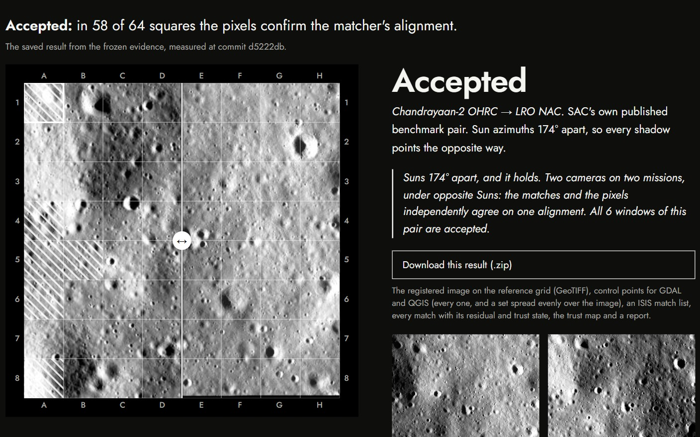
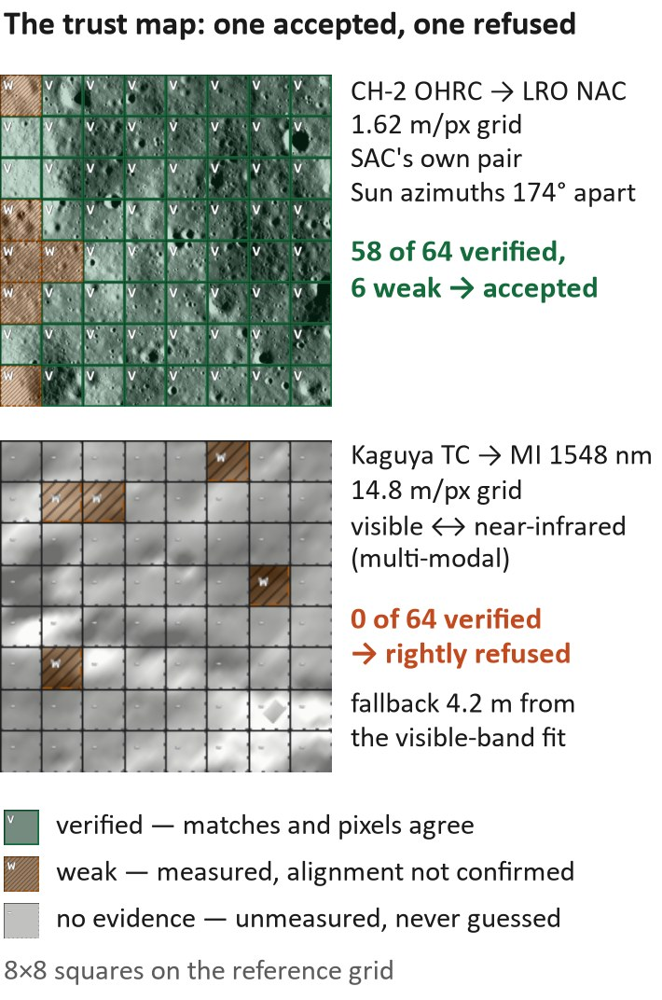
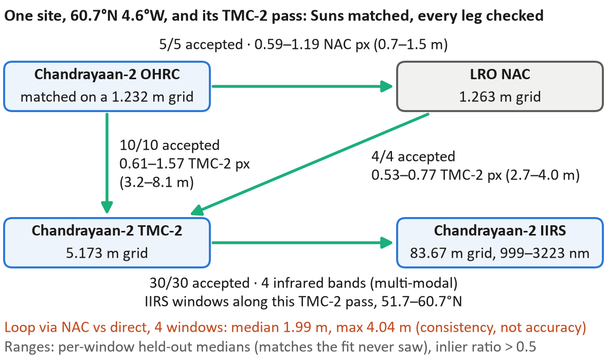
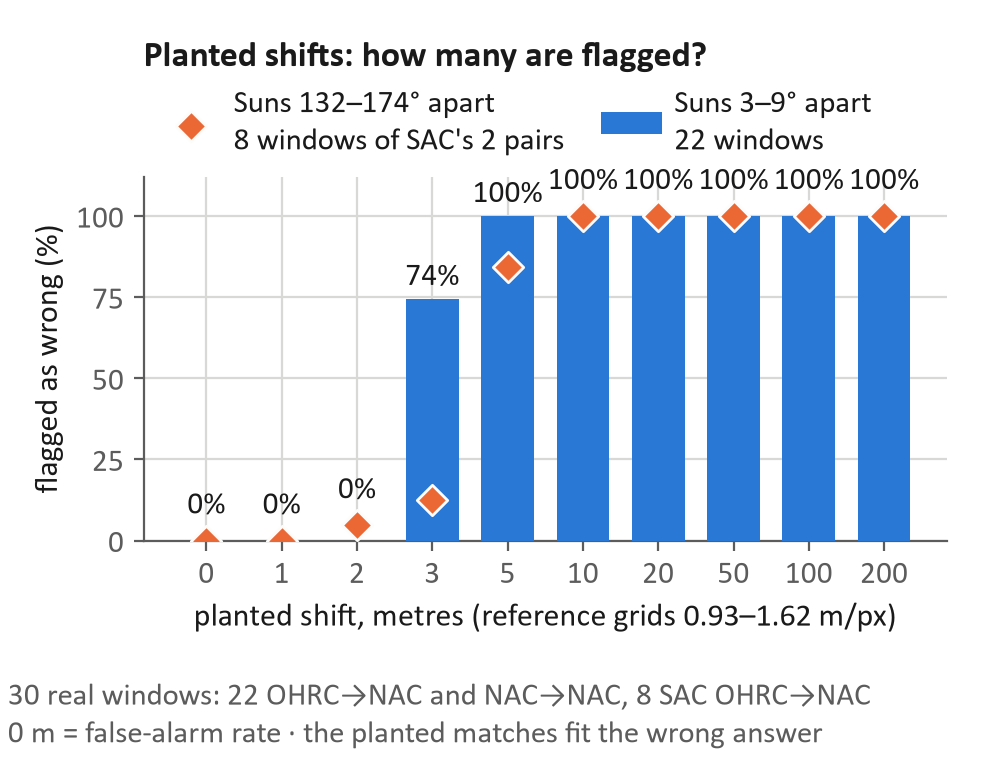
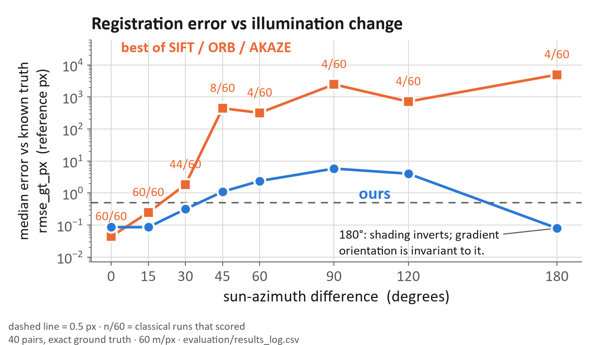
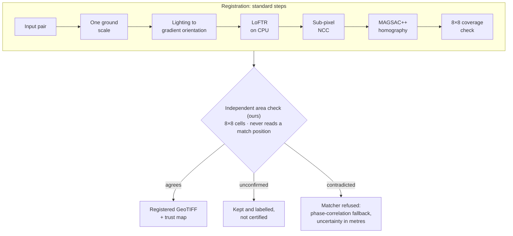
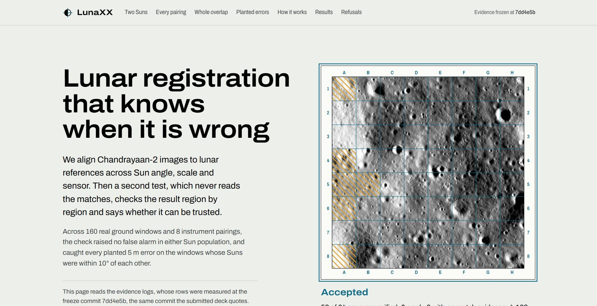

# Lunar image registration that knows when it is wrong

**Team LunaXX** · Smart India Hackathon 2026 · ISRO problem statement **SIH26166**:
*Multi-modal, Sun angle and scale invariant image correspondence using Chandrayaan-2 optical
images (OHRC, TMC and IIRS).*

[](https://github.com/samarthputhraya/sih26166/actions/workflows/tests.yml)
[](LICENSE)


**Try it in a browser: [samarthputhraya.github.io/sih26166](https://samarthputhraya.github.io/sih26166/)**.
Real Chandrayaan-2 registrations from the evidence below. For each one you can drag a divider
across the reference and the aligned image, read the verdict square by square, and download the
result (GeoTIFF and control points for QGIS and GDAL). No install, on a laptop or a phone, in
English or Hindi. To register **your own images**, or test any Moon picture against a transform
whose answer is known, the page's *Open the live workbench* button runs the same pipeline on a
cloud CPU ([direct link](https://lunaxx-215071922486.asia-south1.run.app/); it sleeps when idle,
so the first run waits for it to start).

<p align="center">
  
</p>

A registration method hands back a transform and a residual. On the Moon that is not enough.
Under a low or opposite Sun every shadow moves, and a matcher can fit six matches to a sub-pixel
residual while none of the matches it held back agree with the fit. The residual alone cannot
tell those two cases apart.

This pipeline registers a Chandrayaan-2 image onto a lunar reference and then **checks its own
answer with a test that never reads a match position**: it cross-correlates the warped image
against the reference in an 8×8 grid of cells, and each cell votes on the matcher's transform.
The result comes back with a verdict for the frame (accepted, unconfirmed or refused) and a map
of which regions it can vouch for. A refused result falls back to phase correlation and says
so, with its uncertainty in metres.

<p align="center">
  
</p>

Every result on this page is copied from [`REPORT.md`](REPORT.md), which `python -m ops.make_report`
generates from the evidence logs (on a machine with the imagery) and nobody edits by hand. Each row below names the REPORT.md
section it comes from.

---

## The problem statement, ask by ask

All rows are real data. "Accepted" means the independent check agreed with the matcher's
transform; held-out errors are on the 20 % of matches the fit never saw.

| The problem statement asks for | Measured | REPORT.md section |
|---|---|---|
| **Sun azimuth** | SAC's own equatorial pair [1], OHRC → LRO NAC, Sun azimuths 174° apart: **6 of 6** windows accepted; SIFT, ORB and AKAZE, judged by exactly the same rule, **0 of 6** each. The same OHRC frame against 7 NACs with the Sun 154–177° away in azimuth: 48 of 56, against 0 of 56 for each classical matcher | *SAC's own benchmark pair (equatorial)*; *Sun azimuth and elevation, on SAC's own frame*; *Classical matchers on the same windows* |
| **Sun elevation** | The same frame against 9 NACs, Sun azimuth within 20° of the OHRC's, the Sun raised by up to 41.7°: **61 of 71** accepted; 7 of 8 at the highest Sun | *Sun azimuth and elevation, on SAC's own frame* |
| **Scale** | OHRC → Kaguya TC, 29.6×: 3 of 4 accepted, one of them on dense evidence (0.55 px = 4.0 m on TC's 7.4 m grid) and two on 1 and 7 verified cells. TMC-2 → IIRS, about 16×: every window on two orbits | *Scale rung*; *TMC-2 → IIRS* |
| **Multi-modal** (visible → infrared) | TMC-2 → IIRS at 999–3223 nm: **62 of 62** registrations, 16 places on two orbits in four infrared bands; at 1555 nm, held-out median 0.16–0.32 IIRS px per window = 13.9–27.3 m on IIRS's 73.85 and 83.67 m grids. A whole IIRS strip (1555 nm, 30.3–60.7°N) onto NASA's LRO WAC global map, every 19.2 km window, judged region by region (8 × 8 squares of 2.4 km): **44 of 49** accepted, 3 unconfirmed, 2 refused; the accepted windows verify 0–34 of their 64 squares (median 15.5), held-out median 158 m on the 100 m grid | *TMC-2 → IIRS*; *IIRS → LRO WAC, the whole strip* |
| **Cross-mission** | TMC-2 onto the SELENE (Kaguya) TC ortho map at SAC's own site, every 2.84 km window along 88 km of one pass, none chosen: **31 of 31** accepted, on 7–35 verified squares of 64 (median 22); held-out median 11.7 m on the 7.4 m TC grid over the 21 windows with an inlier ratio above 0.5 (per window 6.5–68.8 m); the two archives disagree by a steady 287 m (median), which each registration removes | *TMC-2 → SELENE TC ortho map at SAC's site* |
| **Accuracy against independent points** | 60 check points clicked by hand on 6 OHRC → LRO NAC windows, with a tool that never reads a registration: our transform lands **1.7–2.4 m RMSE** from them (1.46–2.56 px on the NAC grids), at the clicking precision (1.47 m median, from repeat clicks); the placement the windows were cut at - the archives' geometry after the corrections the cut applies, so not Chandrayaan-2's raw georeference - misses the same points by 2.9–15.1 m. Not sub-pixel: the check cannot resolve finer than the clicks | *Independent check points* |
| **OHRC, TMC and IIRS** | One site at 60.7°N with the Suns matched: OHRC → TMC-2 **10 of 10**, OHRC → LRO NAC 5 of 5, NAC → TMC-2 4 of 4. The chain OHRC → NAC → TMC-2 meets the direct OHRC → TMC-2 with a loop RMS of 1.99 m (median of 4 windows, max 4.04 m; consistency, not accuracy). IIRS onto that same TMC-2 pass, along the strip at 51.7–60.7°N rather than on the site's windows: 30 of 30 | *One site, every camera (Site N)* |
| **Viewpoint** | OHRC → OHRC of the next orbit, viewing directions 40° apart, Sun within 2.2°: **8 of 8**, held-out median 0.91 px = 1.12 m on the 1.232 m grid. TMC-2 fore → aft, 50° apart: 1 of 4 (relief parallax, a measured limit); orthorectified first on ISRO's own TMC-2 DTM of the pass, 2 of 4 | *A real viewpoint test at Site N*; *Real viewpoint: TMC-2 fore → aft*; *Relief* |
| **Sub-pixel, "of source image"** | Where the Chandrayaan-2 image is the coarser grid, in its own pixels: TMC-2 0.36–0.48 px = 1.6–2.2 m against a NAC (4.555 m grid); IIRS at 1555 nm 0.16–0.32 px = 13.9–27.3 m against TMC-2. OHRC → TMC-2 at the site above is 0.61–1.57 TMC-2 px = 3.2–8.1 m over 9 of its 10 windows (the 10th, at an inlier ratio of 0.48, is not quoted), so not every window is sub-pixel. Where OHRC is finer than its reference, the reference grid bounds it: 0.41–1.01 NAC px = 0.51–0.94 m at 74 °S, which is 2.0–3.7 OHRC px | *Sub-pixel accuracy, with the pixel grid named* |
| **Uniform distribution** | Inliers in 95 % or more of the 8 × 8 reference cells on 17 of 20 windows at 74 °S. Every accepted registration also ships `gcps_uniform`: at most 4 control points per cell | *Runtime and match distribution* |
| Usable outputs | GeoTIFF on the reference grid, GDAL and QGIS control points, an ISIS match list, the per-cell trust map, a report with RMSE, inlier count and inlier ratio | *How it works*, below |

<p align="center">
  
</p>

The TMC-2 → IIRS pairs, the Sun-elevation ladder and the site above were measured after the
28 Sep submission and re-run with every other piece of evidence in the current freeze.

---

## Results

Tested on 406 windows (some ground was cut twice under two ids; 347 if the IIRS bands of one
window count once) and 11 instrument pairings (3 of them one instrument against itself) of real Chandrayaan-2, LRO, Kaguya and LOLA data, plus synthetic pairs with exact truth.

| Test | Result | REPORT.md section |
|---|---|---|
| **Sun angle:** SAC's own equatorial benchmark pair [1], OHRC → LRO NAC, Sun azimuths 174° apart, every shadow reversed | **6 of 6** windows accepted | *SAC's own benchmark pair (equatorial)* |
| **Sun angle:** SAC's polar benchmark pair [1] | 4 of 6 windows vouched for, 2 flagged | *SAC's own benchmark pair (polar)* |
| **Sun sweep:** one OHRC frame against 25 NAC frames, 69 windows, Sun azimuths 3.3–152.7° apart | **0** wrong acceptances among the 54 windows the images could judge | *Real sun-angle sweep* |
| **Whole overlap, not chosen windows:** one OHRC frame × one NAC at 74 °S, Suns 3.3° apart, every lit and textured 640-px window, 13.1 km² | **37 of 37** accepted; held-out median 0.61 px = 0.57 m on the 0.93 m NAC grid; 36 of 37 under 3 px | *The whole lit overlap of one OHRC frame with one NAC* |
| **Scale:** OHRC at 0.25 m onto Kaguya TC at 7.4 m (29.6×) | 3 of 4 accepted: one on dense evidence (0.55 px = 4.0 m), two on 1 and 7 verified cells | *Scale rung* |
| **Sub-pixel, exact truth:** synthetic pairs rendered from LOLA, 60 m grid | 0.086 px = 5.1 m with the Suns 0–15° apart; 1.096 px = 65.8 m at 45° | *Sub-pixel accuracy, with the pixel grid named* |
| **Loop closure:** six three-image loops OHRC → NAC A → NAC B | close to 0.107 m on the 1.245 m NAC grid (consistency, not accuracy) | *Loop closure* |
| **Runtime** | median 13.3 s per 640-px window on a laptop CPU (89 OHRC → NAC windows); a 940 km TMC-2 → IIRS strip, 58 windows, cut in 2.9 min and registered in 1.3 min | *Runtime and match distribution*; *A whole strip* |

### Is the check itself any good?

A failure detector is only worth something if its false-alarm rate and its detection floor are
measured. We planted wrong answers of known size into 30 real windows, in two Sun populations
that are never pooled (*Trust layer on real imagery*). For shifts:

- **no false alarm** in 44 correct trials with the Suns within 10°, or in 16 with them
  132–174° apart (a control: these windows were chosen because the check agreed with them, so
  this shows the verdict is stable, not a false-alarm rate on unseen windows; on windows nobody
  chose, the real Sun sweep refused 2 of the 53 it judged right, both at 60–120°);
- **every 5 m shift flagged** with the Suns within 10°, and every 10 m shift with them 132–174°
  apart;
- at 2 m or less almost nothing is caught. That is the floor, and we report it.

**Against the usual test.** A registration is normally judged by its own residual: how well its
matches fit its transform. On the same planted wrong answers of 5 m or more (Suns within 10°), a
residual threshold loose enough to accept every one of these windows' true registrations flags
**0 of 1,056**; the area check flags **1,056 of 1,056**. The planted matches fit the wrong answer
perfectly, so only the pixels can say it is wrong (*Trust layer on real imagery*).

**Visible against infrared.** The same test on 16 TMC-2 → IIRS 1555 nm windows on two orbits, with
the shifts set in IIRS pixels (74–84 m), its own seed and file: no false alarm in 32 trials;
85.9 % of 5-pixel shifts and 99.2 % of 10-pixel shifts flagged (*Visible against infrared*).

Rotations and scale changes are a separate test: they move the corners and not the centre, so a
whole-frame verdict misses them (0 of 120 trials refused at 3 m of corner movement), and it is the
8 × 8 map that catches them: at that same 3 m it strips the verified state from 62–63% of the cells
they move past 2 px, and from 94% over every rotation and scale trial, up to 20 m.

<p align="center">
  
</p>

Errors that are not translations are why the verdict is per region. A rotation or scale change
about the centre leaves the centre still and moves the corners, so a frame-level verdict watches
the wrong place: at 3 m of corner displacement it refuses 0 of 120 trials, at 5 m only 15 of
120. Of the cells such an error moves past 2 px on the reference grid, the 8×8 map strips
verified state from 62–63 % at 3 m (476 of 752 for rotation, 469 of 752 for scale), and from
94 % over every rotation and scale trial, 0–20 m (*Errors that are not translations*).

### What it refuses, and says so

| Case | What happens | REPORT.md section |
|---|---|---|
| Visible → near-infrared, Kaguya TC → MI 1548 nm | matcher refused on 3 of 3 windows; the declared fallback lands 3.4–16.2 m (0.23–1.09 px on MI's 14.8 m grid) from the visible-band registration of the same window | *Kaguya TC → Kaguya MI* |
| OHRC → TMC-2 at SAC's frame, Sun azimuths 120° apart, elevations 9.9° against 69.4°, and a 5× scale gap | 6–7 inliers fitted to 0.13–0.96 px per axis in-sample on the 5.58 m TMC-2 grid, yet 0 % of held-out matches agree: refused on 4 of 4, and again 4 of 4 with the OHRC first placed in LRO's geometry. This test cannot separate the Sun from the scale (REPORT judges the elevation gap the likelier cause). At Site N, another site, with the Suns matched and a 4.2× gap, the same two instruments register 10 of 10 | *SAC's benchmark site: OHRC → TMC-2 nadir*; *OHRC → TMC-2 again* |
| IIRS near-infrared (89 m per pixel, 12× coarser) against Kaguya TC | 0 of 11 accepted when matched direct. In a separate test, IIRS strips of two other orbits register onto their own TMC-2: 62 of 62 | *Kaguya TC → Chandrayaan-2 IIRS* |
| TMC-2 fore → aft (±25°): terrain relief is not a homography | 1 of 4 accepted; 2 of 4 after orthorectification on ISRO's own TMC-2 DTM of the pass (that DTM's label gives an 18 m height standard deviation and a 63 m RMSE against SELENE, which bound what it can fix) | *Real viewpoint: TMC-2 fore → aft*; *Relief* |
| Sun vectors 90° or more apart (MiLOI [3]) | no method we ran registers any of the 16 pairs: ours, SIFT, ORB or AKAZE | *MiLOI* |
| Optical onto elevation, OHRC → LOLA shaded relief | a declared failure | *Declared-failure rung* |

Each refusal in the 28 Sep submission had a planned answer: a reference chosen for its Sun, IIRS
matched through TMC-2 rather than straight onto TC, and orthorectification for relief. All three
have been run: the next section, the Sun finder below, and the DTM test above (1 of 4 → 2 of 4).

### Against SIFT, ORB and AKAZE on the same windows

`ops/classical_real.py` runs the three classical matchers on exactly the windows behind each
result, then sends their matches through everything ours go through after matching: MAGSAC++, the
held-out split, the area check and the fallback. *Accepted* means the same for every method
(*Classical matchers on the same windows, judged by the same rule*).

| Windows | ours | SIFT | ORB | AKAZE |
|---|---|---|---|---|
| SAC's OHRC → LRO NAC pair, Suns 174° apart | **6/6** | 0/6 | 0/6 | 0/6 |
| SAC's frame, Suns 154–177° apart in azimuth | **48/56** | 0/56 | 0/56 | 0/56 |
| SAC's frame, Sun raised up to 41.7°, azimuth within 20° | 61/71 | 58/71 | 59/71 | 59/71 |
| TMC-2 → IIRS beyond 850 nm (multi-modal) | **62/62** | 61/62 | 54/62 | 52/62 |
| IIRS 1555 nm → LRO WAC, the whole strip, 19.2 km windows | **44/49** | 23/49 | 37/49 | 18/49 |
| TMC-2 → SELENE TC ortho map, every window at SAC's site | **31/31** | 23/31 | 28/31 | 19/31 |
| TMC-2 fore → aft, orthorectified on the pass's DTM | 2/4 | 0/4 | 2/4 | 1/4 |

With the Suns matched (Site N's three legs, the 746 nm control) and across a 40° viewpoint change,
every method registers almost every window: the classical matchers are not weak, they fail where the
Sun moves. Over all 336 windows, the area check refused 11, 18 and 24 of the windows where SIFT's,
ORB's and AKAZE's own residual looked fine.

### Choosing the reference by its Sun

`python -m ops.find_reference <Chandrayaan-2 product id>` (or `lunaxx-find-reference` after
`pip install -e .`) ranks every image that covers a Chandrayaan-2 footprint - every OHRC, TMC-2
nadir and IIRS product in PRADAN's footprint catalogue and every LRO NAC this project knows - by
the angle between the two Sun directions, computed from each image's start time (`ops/lunar_sun.py`,
Meeus, no ephemeris file; within 0.04° of LROC's own published sub-solar points). On Site N's OHRC
frame the three images its evidence uses rank 4, 7 and 9 of 42. Run over the whole archive
(`ops/reference_index.py`), **208 of the 300 OHRC observations** already have an image from another
orbit lit within 5° of their Sun; the console's *Find a reference* panel searches that index
(*Choosing the reference by its Sun*).

### TMC-2 and IIRS, in detail

| Test | Result |
|---|---|
| **TMC-2 → IIRS, two orbits.** PRADAN's catalogue shows the two instruments imaging the same ground seconds apart, so the Sun is the same. 8 windows per orbit chosen before any matching, the same places in every band; TMC-2 at 4.6 and 5.2 m against IIRS at 74 and 84 m (16×) | **62 of 62** registrations (16 places) accepted in the bands beyond TMC-2's 400–850 nm passband (999, 1555, 2381 and 3223 nm: multi-modal), plus 8 of 8 at 746 nm, the control. At 1555 nm the held-out median is 0.21–0.32 px = 15.6–23.6 m (first orbit, 73.85 m grid) and 0.16–0.32 px = 13.9–27.3 m (second, 83.67 m grid). Each band is registered on its own; how far each band's transform lands from the 1555 nm one is in REPORT.md, and is consistency, not accuracy |
| **LRO NAC → TMC-2** at SAC's site, the NAC chosen for a Sun 2.6–3.2° from the TMC-2 pass's in azimuth and 4.3–4.5° in incidence | **6 of 6** accepted; held-out median 0.36–0.48 px = 1.6–2.2 m on TMC-2's 4.56 m grid |
| The same NAC → the 2025 TMC-2 pass, Suns 45° apart | 3 accepted on thin evidence (4–6 verified cells; no accuracy quoted), 2 unconfirmed, 1 refused |
| **Site N**, OHRC → TMC-2 with the Suns 2.2–2.3° apart in azimuth and 0.5° in incidence | **10 of 10** accepted; held-out median 0.61–1.57 px = 3.2–8.1 m on TMC-2's 5.17 m grid over 9 windows, the 10th not quoted at an inlier ratio of 0.48 (OHRC area-averaged to 1.23 m first) |

---

## The questions a judge will ask

Measured figures below come from REPORT.md, with the section named; the few that come from a
product label, a pair's `geometry_prior.json`, an evaluation CSV or PRADAN's footprint catalogue say so. Two kinds of
arithmetic on them are marked as such: confidence bounds, and one projection.

### Why does a Sun 174° away pass, when 90° fails?

A Sun on the opposite side of the sky reverses the shading: lit slopes go dark and dark slopes
light up, close to a contrast inversion of the whole image. The matcher never sees brightness. It
sees gradient orientation taken modulo 180° (`core/illumination.py`), where a bright-to-dark edge
and a dark-to-bright edge have the same value, so an inversion cancels. A Sun moved 90° changes
*which* slopes are lit: edges facing it appear, edges along it fade. The edges themselves differ
between the two images, not only their sign, and no re-encoding of one image recovers edges that
are missing from the other.

<p align="center">
  
</p>

| Sun azimuths apart | 0° | 45° | 90° | 120° | 180° |
|---|---|---|---|---|---|
| ours, median error on the 60 m grid | 0.086 px (5.1 m) | 1.096 px (65.8 m) | 5.805 px (348 m) | 4.025 px (242 m) | 0.080 px (4.8 m) |
| SIFT / ORB / AKAZE runs that return any answer | 75 of 75 | 10 of 75 | 5 of 75 | 5 of 75 | 5 of 75 |

*Synthetic Sun-azimuth sweep* in REPORT.md. The classical runs that do answer past 45° are off by
hundreds to thousands of pixels; at 0° they beat us (0.044 px against 0.086). The 180° point
flatters us: the renderer has no cast shadows, so its flip is an almost exact inversion. On real
terrain we expect the flip to work only while both Suns are high enough for shading, not shadow,
to dominate. The real data fit that, though the far-Sun failures all come from one scene:

- SAC's equatorial pair, Suns 174° apart and 9.9° and about 18° above the horizon (the pairs'
  `geometry_prior.json`): 6 of 6 windows accepted (*SAC's own benchmark pair (equatorial)*).
- The real sweep: 10 of 15 windows accepted at 120–153° apart, and 0 of 12 at 60–120°. There,
  every window was refused or left unconfirmed; of the 3 the image evidence could judge, 2 were
  correct registrations refused and 1 a failure caught (*Real sun-angle sweep*).
- MiLOI's 16 pairs 90° or more apart are all in one scene, 11 images with the Sun within 3° of
  the horizon (incidence 87.4–90.9°, `evaluation/miloi_illumination.csv`), where cast shadow
  should dominate. No method we ran registers any of them (*MiLOI*).
- The detection floor pays for the flip. With the Suns within 10° every planted 5 m error is
  flagged; 132–174° apart, it takes 10 m (*Trust layer on real imagery*).

### What do the zero counts actually bound?

Zero events in *n* trials is not a zero rate. With none observed, the rate is below about 3/*n*
at 95 % confidence (the rule of three, slightly conservative; arithmetic, not a measurement). Our
trials are only as independent as the windows they were drawn from, so the bound is given both
ways:

| Nothing observed | Trials | Windows | 95 % bound, per trial | per window |
|---|---|---|---|---|
| False alarm, Suns within 10° | 0 of 44 | 22 | 7 % | 14 % |
| False alarm, Suns 132–174° apart | 0 of 16 | 8 | 19 % | 38 % |
| Planted 5 m error missed, Suns within 10° | 0 of 176 | 22 | 1.7 % | 14 % |
| Planted 10 m error missed, Suns 132–174° apart | 0 of 64 | 8 | 4.7 % | 38 % |
| Real sweep: accepted, but wrong by image evidence | 0 of 54 windows it could judge | 54 | | 6 % |
| MiLOI: accepted (`agrees`), but its transform over 3 px from truth | 0 of 33 accepted pairs | 33 | | 9 % |

Even the window counts overstate independence. The 22 windows come from three image pairings
(one of them NAC → NAC) and cover only 10 distinct window centres; the 8 come from SAC's two
pairs.

What these do not cover:

- The false-alarm rows re-check windows chosen because the check agreed with them (step 1 of
  `ops/trust_real_calibration.py`), so they bound instability, not false alarms on unseen windows.
  For those, the real Sun sweep: 2 of the 53 windows it judged right were refused.
- The planted errors are translations. Rotations and scale changes are caught cell by cell, not
  by the frame verdict (above).
- The real sweep is judged by image evidence (|NCC| ≥ 0.30), not ground truth. Only one of the 54
  judged windows was a failure (it was caught), so this row bounds wrong acceptances and says
  nothing about the catch rate. 41 of the 54 are under 60° apart. 15 of the 69 windows could not
  be judged; none of those was accepted, so nothing accepted escaped the check.
- In MiLOI, 5 more pairs were left `unconfirmed` rather than refused, and all 5 were wrong;
  REPORT.md counts them as missed failures. Its truth is a network built from pairs where ours and
  SIFT agree, and 13 of the 33 accepted pairs are in the scene whose truth error cannot be
  measured.

### How long would a full OHRC strip take?

**Measured.** The whole lit overlap of the 74 °S frame with one NAC, 37 windows of 596 m
(13.1 km²), took 10.5 minutes of `run_all`, a median of 17.1 s per window, on a laptop CPU only, no
discrete GPU (*The whole lit overlap of one OHRC frame with one NAC*). Over 89 OHRC → NAC windows
the median is 13.3 s (*Runtime and match distribution*).

**Projected, not measured.** That OHRC product is 93,693 lines × 12,000 samples, and its label's
corner coordinates put it at about 25.6 × 2.9 km, or 73 km². Tiled at the same 596 m it needs about
215 windows (43 along, 5 across), roughly 48–61 minutes at 13.3–17.1 s each. At the same measured
rate (75 km² per hour), all 23,651 km² of OHRC in PRADAN's catalogue is about 314 laptop-hours
(*Runtime and match distribution*). That is registration only:
reading and cutting the 1.1 GB product was not timed. Windows are independent, so the work splits
across cores or machines, but we have not measured that. The time scales with the number of
windows on the reference grid, so that range holds for a reference of about 1 m, like a NAC. A
finer reference costs more.

### Why were TMC-2 and IIRS refused on 28 Sep, and what changed?

In the submitted evidence:

- **OHRC → TMC-2**, on the only TMC-2 pass that covers all of SAC's frame (PRADAN's footprint
  catalogue): the Sun moved 120° in azimuth *and* from 9.9° to 69.4° above the horizon, with a
  5× scale change on top. MAGSAC++ kept 6–7 of 90–148 matches and fitted them to 0.13–0.96 px on
  TMC-2's 5.576 m grid, yet none of the held-out matches landed within 3 px and not one of the 64
  cells verified, so the check refused all 4 windows. Separately, the OHRC archive grid there sits
  1.9 km from LRO's; re-cut with the OHRC first placed in LRO's geometry, the pair is still refused
  4 of 4.
- **Kaguya TC → IIRS**: IIRS pixels are 89 m, so the reference window is only 112 px against a TC
  source 12× finer, in a different band. 4–7 inliers per window; 0 of 11 accepted.

What changed was taking the Sun out of the problem instead of fighting it:

- **IIRS and TMC-2 fly together.** PRADAN's footprint catalogue shows them imaging the same ground
  on the same orbit, seconds apart, so the Sun is the same and only the band and the 16×
  scale change. On two such orbits every window registers in every band (62 of 62 beyond 850 nm, at 16 places).
  We expect this to be the easy case, and say so: under one Sun, shading and albedo should
  dominate the Moon at 1.5 µm much as in visible light. The weakest band is 3223 nm.
- **Choose the pass by its Sun.** Searching PRADAN's catalogue and the LRO footprints for a place
  where an OHRC frame, a TMC-2 pass with its own IIRS strip, and an LRO NAC all have Suns within a
  few degrees found Site N, at 60.7°N (the IIRS windows lie along that TMC-2 pass, at 51.7–60.7°N). There OHRC → TMC-2 registers 10 of 10, and the two-mission
  loop OHRC → NAC → TMC-2 against OHRC → TMC-2 closes to a median 1.99 m over 4 windows, max 4.04 m
  (0.38 px on TMC-2's 5.17 m grid; consistency, not accuracy).

What it does not show: Site N is one site; OHRC → TMC-2 there is 0.61–1.57 TMC-2 px held-out over 9
of 10 windows, so not sub-pixel in every window; and OHRC → TMC-2 under a Sun far from the OHRC's is still refused.
At SAC's frame the Sun and the 5× scale change together, so that refusal does not say which of
the two was too much (REPORT judges the 59° elevation gap the likelier cause, because the frozen
evidence accepts much larger azimuth gaps at low, similar elevations).

### Does it hold when the Sun rises, not only when it turns?

SAC's equatorial OHRC frame has the Sun 9.9° above the horizon. We searched the LRO archive for
NAC images of the same ground whose Sun keeps nearly the same azimuth but stands higher, and
registered the OHRC onto each with nothing from either image in the prior (OHRC placed by SAC's
NAC correction, every NAC by LROC's published corners), on one 1.75 m grid and one set of windows
fixed beforehand (*Sun azimuth and elevation, on SAC's own frame*):

- Sun raised by up to 41.7°, azimuth within 20°: 61 of 71 windows accepted, 8 unconfirmed,
  2 refused. At the highest Sun, 7 of 8.
- The same frame with the Sun on the opposite side, 154–177° away in azimuth, at several
  elevations: 48 of 56 accepted. At the highest of those (+47°) it drops to 4 of 8, with 3 refused.

These are not clean single-variable tests: the NACs also differ in viewing angle (emission
1–16°), and the azimuth drifts by up to 19.7° on the highest rungs. REPORT.md lists both for
every NAC.

### Is there a real viewpoint test?

Yes. At Site N the OHRC imaged the same ground on two consecutive orbits, once looking forward
and once looking back, two hours apart, the Sun within 2.2°. At the windows the two viewing
directions are 39.6–39.8° apart. Both frames are placed by the same NAC's correction against each,
never fitted to one another. All 8 windows register; held-out median 0.91 px = 1.12 m on a
1.232 m grid, from 0.49 to 2.15 px per window. A single homography per window cannot absorb relief
parallax between the two views; we have not separated that from matching error. TMC-2's fore and aft
cameras, 50° apart, register 1 of 4 (*Real viewpoint: TMC-2 fore → aft*): that is the limit we
report. Orthorectified first on TMC-2's own DTM of the pass, they register 2 of 4 (*Relief*).

---

## How it works


```mermaid
flowchart TD
    subgraph R["Registration: standard steps"]
        direction LR
        A["Input pair"] --> B["One ground<br/>scale"] --> C["Lighting to<br/>gradient orientation"] --> D["LoFTR<br/>on CPU"] --> E["Sub-pixel<br/>NCC"] --> F["MAGSAC++<br/>homography"] --> G["8×8 coverage<br/>check"]
    end
    R --> H{"Independent area check (ours)<br/>8×8 cells · never reads a match position"}
    H -- agrees --> I["Registered GeoTIFF<br/>+ trust map"]
    H -- unconfirmed --> J["Kept and labelled,<br/>not certified"]
    H -- contradicted --> K["Matcher refused:<br/>phase-correlation fallback,<br/>uncertainty in metres"]
```

`core/pipeline.py` → `run_all()`, in the order it runs:

| Step | Module | What it does |
|---|---|---|
| 1 | `core/io_loader.py` | PDS4 (Chandrayaan-2), PDS3 (LRO, Kaguya) and GeoTIFF, read in windows |
| 2 | `core/scale.py` | both images to one ground scale, by area averaging |
| 3 | `core/illumination.py` | lighting reduced to gradient orientation |
| 4 | `core/matcher.py` | LoFTR [4] through kornia, on CPU, tiled |
| 5 | `core/subpixel.py` | NCC refinement of the matches, in original pixels |
| 6 | `core/ransac.py` | MAGSAC++ [5] (`cv2.USAC_MAGSAC`) |
| 7 | `evaluation/metrics.py` | the metrics, plus residuals on the 20 % of matches the fit never saw |
| 8 | `core/reliability.py` | the trust map and the area check, then the fallback when contradicted |
| 9 | `core/export.py` | the deliverables below |

**The trust layer** (`core/reliability.py`) is the contribution. A cell is `verified` only when
it holds at least 3 inliers, at least half of its raw matches survive MAGSAC++, and an FFT
cross-correlation of the warped image against the reference peaks within 2 px of zero at NCC
0.30 or more. A cell with no matches is `no_evidence`; it is never filled in by interpolation.
The frame `agrees` when at least half of the cells that can be measured agree with the
transform, and is `contradicted` below a quarter. The thresholds are design constants in that
file, and the prior art they build on is cited in its docstring [6–9].

**Deliverables**, for every pair, written to `--out DIR`:

- `registered_product.tif`, a GeoTIFF on the reference grid;
- `matches.csv`, every raw match with its inlier flag, residual and cell state;
- ground control points for GDAL (`-gcp`) and QGIS (`.points`): every inlier, and
  `gcps_uniform.*`, thinned to at most 4 per cell of an 8 × 8 grid on the reference, lowest
  residual first, so the points are spread over the image by construction;
- `matches_isis.csv`, an ISIS-style match list;
- `trust_map.csv`, the 8×8 cell states;
- `report.json` and `report.md`: metrics, timings, input sha256 and library versions.

<p align="center">
  
  <br/><sub>The Mission Console (<code>web/</code>). Published at <a href="https://samarthputhraya.github.io/sih26166/">samarthputhraya.github.io/sih26166</a> with the saved results; run <code>python -m web.server</code> and the same page registers your own images live, tests one image against a known warp, or re-runs any real pair, and downloads the result; the published page links a hosted copy of that workbench.</sub>
</p>

---

## Quick start

Python 3.12. No discrete GPU is needed or used; `requirements.txt` pulls the CPU build of PyTorch.

```
python -m venv .venv
.venv\Scripts\activate              # Windows;  source .venv/bin/activate elsewhere
pip install -r requirements.txt
python -m core.fetch_weights        # LoFTR weights into weights/, once (the only network step)
python -m pytest -q                 # the test suite; needs no imagery and no data_path.txt
```

Imagery is not in git. To register a real pair, download the products in
[`data/products_manifest.csv`](data/products_manifest.csv) - the 262 files of REPORT.md's *Products
downloaded*, each with its URL, size and sha256 (Chandrayaan-2 from PRADAN, which needs a free login;
LRO from the NASA PDS; Kaguya from JAXA; the LRO WAC mosaic is read over HTTP by `ops/cut_wac_pairs.py`) -
put their folder's path in a one-line `data_path.txt` at the repository root, and cut pairs from them:

```
python -m ops.cut_pradan_pairs ohrc-nac              # SAC's equatorial OHRC -> LRO NAC pair
python -m ops.cut_site_pairs --help                  # OHRC -> NAC pairs at the 74 °S site
python -m ops.cut_chain_pairs --help                 # TMC-2 -> IIRS, the Sun ladder, Site N, viewpoint
python -m core.pipeline data/pairs/sac_ohrc_nac_w01 --out out/sac_w01
```

Each pair folder records the product ids, grids, Sun geometry and the command that cut it in its
`geometry_prior.json`.

| Command | What it does |
|---|---|
| `streamlit run app/streamlit_app.py` | the demo app, offline, from cached results in `demo_cache/` |
| `python -m ops.precompute_demo_cache <pair> ...` | fill that cache for the pairs you name |
| `python -m web.build_console` | the Mission Console → `web/dist/index.html`; with `--site`, the published copy (see `web/README.md`) |
| `python -m web.server` | the console as a live workbench: register your own images, a one-image known-answer test, or any real pair, and download the result |
| `python -m ops.run_real_pairs "sac_ohrc_nac_w*" --log` | register pairs, export deliverables, append to the evidence log |
| `python -m ops.make_report` | regenerate REPORT.md from the logs |
| `python -m ops.freeze --plan` / `--check` | the evidence freeze: what would re-run / whether every row is from one commit |

---

## Reproducibility

No number is typed into REPORT.md. It is rendered from these logs:

| Log | Holds |
|---|---|
| `evaluation/real_pairs_log.csv` | every real pair: Sun geometry, window, archive offset, held-out and in-sample residuals, verdict, commit |
| `evaluation/trust_real_calibration.csv` | the planted wrong registrations, both Sun populations |
| `evaluation/trust_real_calibration_ir.csv` | the same test visible against infrared (TMC-2 → IIRS 1555 nm), in IIRS pixels |
| `evaluation/check_points/*.csv` | the hand-clicked independent check points, one file per window, with the pair files' hashes |
| `evaluation/miloi_log.csv`, `miloi_truth.json` | the MiLOI benchmark and its truth network |
| `evaluation/multimodal_check.csv` | the infrared fallback against the visible-band registration of the same window |
| `evaluation/results_log.csv` | every scored synthetic and baseline run |

`python -m ops.freeze` re-runs every piece of evidence on one clean commit, and `--check` reports
whether each logged row was measured at it. The evidence on this page was measured at freeze
commit `04ed5f6` (the 28 Sep submission's was `7dd4e5b`); REPORT.md's first lines name the commits
it was generated from.

## Terminology we hold ourselves to

- **Cross-sensor** means different instruments. LRO NAC ↔ LRO NAC, OHRC ↔ OHRC and TMC-2 fore ↔
  aft are the *same sensor* and are tested as Sun-angle and viewpoint cases, never counted as
  cross-sensor. OHRC ↔ TMC-2 is cross-sensor within one mission; OHRC or TMC-2 ↔ LRO NAC is
  cross-sensor and cross-mission.
- **Multi-modal** means visible ↔ infrared, radar or elevation. Two panchromatic cameras are not
  multi-modal.
- **Sub-pixel** always names its pixel grid and gives the metres.

## Repository layout

| Folder | Contents |
|---|---|
| `core/` | the pipeline modules above, plus `geometry` (map projections, NAC corrections) |
| `evaluation/` | metrics, synthetic and shaded-relief pairs, the real-pair evaluators, the evidence logs |
| `baselines/` | SIFT, ORB and AKAZE, and their sweeps |
| `app/` | `streamlit_app.py` (the demo) and `change_detection.py`, gated by the trust map |
| `web/` | the Mission Console: a registration workbench plus the logged evidence in one self-contained page, and the local server that makes the workbench live |
| `ops/` | pair cutting, runners, the evidence freeze, the report generator, and the PRADAN data guide (`ops/national_round/PRADAN_GUIDE.md`) |
| `presentation/` | the pitch deck's builder (`build_deck.py`) and its figures (`make_figures.py`) |

## References

1. Makharia, Singla, Amitabh, Dube, Sharma. Space Applications Centre (ISRO) and Manipal
   University Jaipur, 2025. [arXiv:2509.04775](https://arxiv.org/abs/2509.04775)
2. Singh, Singla, Hemrajani, Dube, Amitabh, Patel. *Towards Seamless Lunar Mosaics.* Space
   Applications Centre, 2026. [arXiv:2604.25208](https://arxiv.org/abs/2604.25208)
3. Xie, Liu, Di et al. *Remote Sensing* 17(13):2302, 2025 (MiLOI dataset).
4. Sun et al. *LoFTR: Detector-free local feature matching with transformers.* CVPR 2021.
   [arXiv:2104.00680](https://arxiv.org/abs/2104.00680)
5. Barath et al. *MAGSAC++.* CVPR 2020. [arXiv:1912.05909](https://arxiv.org/abs/1912.05909)
6. Uss, Vozel, Lukin, Chehdi. IEEE TGRS, 2016. [arXiv:1602.02720](https://arxiv.org/abs/1602.02720)
7. Brown and Lowe. *Automatic panoramic image stitching using invariant features.* IJCV 74(1), 2007.
8. Wan, Shao, Li, 2021. [arXiv:2106.12738](https://arxiv.org/abs/2106.12738)
9. Truong et al. *PDC-Net.* CVPR 2021. [arXiv:2101.01710](https://arxiv.org/abs/2101.01710)

**Data:** Chandrayaan-2 OHRC, TMC-2 and IIRS from ISRO's PRADAN (pradan.issdc.gov.in); LRO
LROC NAC and LOLA from the NASA Planetary Data System (public domain); SELENE (Kaguya) TC and MI
from JAXA; MiLOI from github.com/Bin501/CNSFM, used for evaluation only. None of it is
redistributed here.

## Licence

Apache License 2.0 - see [`LICENSE`](LICENSE). Third-party software and data are listed in
[`NOTICE`](NOTICE).

## Team LunaXX

Samartha (pipeline, trust layer, app) · Samrudh (evaluation) · Risheeth (baselines) ·
Rishabh (change detection) · Saniya (presentation) · Rohan (data).
