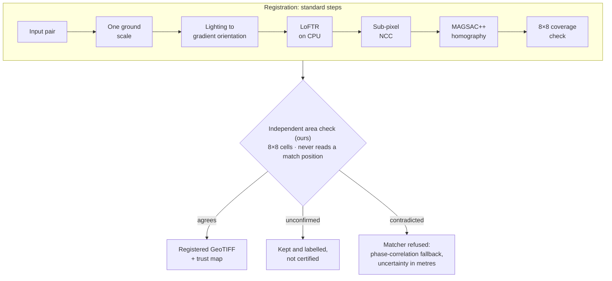

# Lunar image registration that knows when it is wrong

**Team LunaXX** · Smart India Hackathon 2026 · ISRO problem statement **SIH26166**:
*Multi-modal, Sun angle and scale invariant image correspondence using Chandrayaan-2 optical
images (OHRC, TMC and IIRS).*

[](LICENSE)


A registration method hands back a transform and a residual. On the Moon that is not enough.
Under a low or opposite Sun every shadow moves, and a matcher can fit six matches to a sub-pixel
residual while none of the matches it held back agree with the fit. The residual alone cannot
tell those two cases apart.

This pipeline registers a Chandrayaan-2 image onto a lunar reference and then **checks its own
answer with a test that never reads a match position**: it cross-correlates the warped image
against the reference in an 8×8 grid of cells, and each cell votes on the matcher's transform.
The result comes back with a verdict for the frame (accepted, unconfirmed or refused) and a map
of which regions it can vouch for. A refused result falls back to phase correlation and says
so, with its uncertainty in metres.

<p align="center">
  
</p>

Every result on this page is copied from [`REPORT.md`](REPORT.md), which is generated from the
evidence logs by one command and never edited by hand. Each row below names the REPORT.md
section it comes from.

---

## Results

Tested on 160 distinct ground windows and 8 instrument pairings of real Chandrayaan-2, LRO,
Kaguya and LOLA data, plus synthetic pairs with exact truth.

| Test | Result | REPORT.md section |
|---|---|---|
| **Sun angle:** SAC's own equatorial benchmark pair [1], OHRC → LRO NAC, Sun azimuths 174° apart, every shadow reversed | **6 of 6** windows accepted | *SAC's own benchmark pair (equatorial)* |
| **Sun angle:** SAC's polar benchmark pair [1] | 4 of 6 windows vouched for, 2 flagged | *SAC's own benchmark pair (polar)* |
| **Sun sweep:** one OHRC frame against 25 NAC frames, 69 windows, Sun azimuths 3.3–152.7° apart | **0** undetected failures | *Real sun-angle sweep* |
| **Whole overlap, not chosen windows:** one OHRC frame × one NAC at 74 °S, Suns 3.3° apart, every lit and textured 640-px window, 13.1 km² | **37 of 37** accepted; held-out median 0.61 px = 0.57 m on the 0.93 m NAC grid; 36 of 37 under 3 px | *The whole lit overlap of one OHRC frame with one NAC* |
| **Scale:** OHRC at 0.25 m onto Kaguya TC at 7.4 m (29.6×) | 3 of 4 accepted | *Scale rung* |
| **Sub-pixel, exact truth:** synthetic pairs rendered from LOLA, 60 m grid | 0.086 px = 5.1 m with the Suns 0–15° apart; 1.096 px = 65.8 m at 45° | *Sub-pixel accuracy, with the pixel grid named* |
| **Loop closure:** six three-image loops OHRC → NAC A → NAC B | close to 0.107 m on the 1.245 m NAC grid (consistency, not accuracy) | *Loop closure* |
| **Runtime** | median 8.2 s per 640-px window on a laptop CPU (89 OHRC → NAC windows) | *Runtime and match distribution* |

### Is the check itself any good?

A failure detector is only worth something if its false-alarm rate and its detection floor are
measured. We planted wrong answers of known size into 30 real windows, in two Sun populations
that are never pooled (*Trust layer on real imagery*). For shifts:

- **no false alarm** in 44 correct trials with the Suns within 10°, or in 16 with them
  132–174° apart;
- **every 5 m shift flagged** with the Suns within 10°, and every 10 m shift with them 132–174°
  apart;
- at 2 m or less almost nothing is caught. That is the floor, and we report it.

Rotations and scale changes are a separate test: they move the corners and not the centre, so a
whole-frame verdict misses them (0 of 120 trials refused at 3 m of corner movement), and it is the
8 × 8 map that catches them, stripping the verified state from 94% of the cells they move past 2 px.

<p align="center">
  
</p>

Errors that are not translations are why the verdict is per region. A rotation or scale change
about the centre leaves the centre still and moves the corners, so a frame-level verdict watches
the wrong place: at 3 m of corner displacement it refuses 0 of 120 trials, at 5 m only 15 of
120. Of the cells such an error moves past 2 px on the reference grid, the 8×8 map strips
verified state from 94 % (*Errors that are not translations*).

### What it refuses, and says so

| Case | What happens | REPORT.md section |
|---|---|---|
| Visible → near-infrared, Kaguya TC → MI 1548 nm | matcher refused on 3 of 3 windows; the declared fallback lands 3.4–16.2 m (0.23–1.09 px on MI's 14.8 m grid) from the visible-band registration of the same window | *Kaguya TC → Kaguya MI* |
| OHRC → TMC-2, Sun azimuths 120° apart | 6–7 inliers fitted to 0.13–0.96 px per axis in-sample on the 5.58 m TMC-2 grid, yet 0 % of held-out matches agree: refused on 4 of 4 | *SAC's benchmark site: OHRC → TMC-2 nadir* |
| IIRS near-infrared (89 m per pixel, 12× coarser) against Kaguya TC | 0 of 11 accepted when matched direct | *Kaguya TC → Chandrayaan-2 IIRS* |
| TMC-2 fore → aft (±25°): terrain relief is not a homography | 1 of 4 accepted | *Real viewpoint: TMC-2 fore → aft* |
| Sun vectors 90° or more apart (MiLOI [3]) | no method we ran registers any of the 16 pairs: ours, SIFT, ORB or AKAZE | *MiLOI* |
| Optical onto elevation, OHRC → LOLA shaded relief | a declared failure | *Declared-failure rung* |

The OHRC → TMC-2 pass above is the closest-Sun TMC-2 coverage of SAC's frame that we found in
PRADAN's footprint catalogue. Each refusal had a planned answer: re-pairing with a closer-Sun
reference, tile-level transforms with orthorectification for relief, and IIRS matched through
TMC-2 rather than straight onto TC. The first and last have now been run.

### After the submission: TMC-2 and IIRS register

Measured on 28 Sep 2026, after the idea was submitted, so **not part of the evidence freeze**
above; REPORT.md keeps them in their own section (*After the submission: IIRS and TMC-2, and the
route between them*).

| Test | Result |
|---|---|
| **IIRS → TMC-2 on one orbit.** PRADAN's catalogue shows the two instruments imaging the same ground seconds apart, so the Sun is the same. 8 windows chosen before any matching; TMC-2 at 4.56 m against IIRS at 73.9 m (16×) | **8 of 8** accepted in each of five IIRS bands, 746 to 3223 nm. At 1555 nm (visible against near-infrared: multi-modal): held-out median 0.21–0.32 px = 16–24 m on the IIRS grid |
| **LRO NAC → TMC-2**, the NAC chosen for a Sun within 3° of the TMC-2 pass's | **6 of 6** accepted; held-out median 0.36–0.48 px = 1.6–2.2 m on TMC-2's 4.56 m grid |
| The same NAC → the 2025 TMC-2 pass, Suns 45° apart | 3 accepted on thin evidence (4–6 verified cells), 2 unconfirmed, 1 refused |
| **OHRC → TMC-2 re-cut** after removing a 1.9 km offset between the two archives at SAC's frame | still **refused 4 of 4**: with the geometry fixed, a Sun 120° apart is what stops it |

---

## The questions a judge will ask

Measured figures below come from REPORT.md, with the section named; the few that come from a
product label, a pair's `geometry_prior.json` or PRADAN's footprint catalogue say so. Two kinds of
arithmetic on them are marked as such: confidence bounds, and one projection.

### Why does a Sun 174° away pass, when 90° fails?

A Sun on the opposite side of the sky reverses the shading: lit slopes go dark and dark slopes
light up, close to a contrast inversion of the whole image. The matcher never sees brightness. It
sees gradient orientation taken modulo 180° (`core/illumination.py`), where a bright-to-dark edge
and a dark-to-bright edge have the same value, so an inversion cancels. A Sun moved 90° changes
*which* slopes are lit: edges facing it appear, edges along it fade. The edges themselves differ
between the two images, not only their sign, and no re-encoding of one image recovers edges that
are missing from the other.

<p align="center">
  
</p>

| Sun azimuths apart | 0° | 45° | 90° | 120° | 180° |
|---|---|---|---|---|---|
| ours, median error on the 60 m grid | 0.086 px (5.1 m) | 1.096 px (65.8 m) | 5.805 px (348 m) | 4.025 px (242 m) | 0.080 px (4.8 m) |
| SIFT / ORB / AKAZE runs that return any answer | 60 of 60 | 8 of 60 | 4 of 60 | 4 of 60 | 4 of 60 |

*Synthetic Sun-azimuth sweep* in REPORT.md. The classical runs that do answer past 45° are off by
hundreds to thousands of pixels; at 0° they beat us (0.044 px against 0.086). The 180° point
flatters us: the renderer has no cast shadows, so its flip is an almost exact inversion. On real
terrain we expect the flip to work only while both Suns are high enough for shading, not shadow,
to dominate. The real data fit that, though the far-Sun failures all come from one scene:

- SAC's equatorial pair, Suns 174° apart and 9.9° and 17.8° above the horizon (the pairs'
  `geometry_prior.json`): 6 of 6 windows accepted (*SAC's own benchmark pair (equatorial)*).
- The real sweep: 10 of 15 windows accepted at 120–153° apart, and 0 of 12 at 60–120°. There,
  every window was refused or left unconfirmed; of the 3 the image evidence could judge, 2 were
  correct registrations refused and 1 a failure caught (*Real sun-angle sweep*).
- MiLOI's 16 pairs 90° or more apart are all in one scene, 11 images with the Sun within 3° of
  the horizon (incidence 87.4–90.9°, `evaluation/miloi_illumination.csv`), where cast shadow
  should dominate. No method we ran registers any of them (*MiLOI*).
- The detection floor pays for the flip. With the Suns within 10° every planted 5 m error is
  flagged; 132–174° apart, it takes 10 m (*Trust layer on real imagery*).

### What do the zero counts actually bound?

Zero events in *n* trials is not a zero rate. With none observed, the rate is below about 3/*n*
at 95 % confidence (the rule of three, slightly conservative; arithmetic, not a measurement). Our
trials are only as independent as the windows they were drawn from, so the bound is given both
ways:

| Nothing observed | Trials | Windows | 95 % bound, per trial | per window |
|---|---|---|---|---|
| False alarm, Suns within 10° | 0 of 44 | 22 | 7 % | 14 % |
| False alarm, Suns 132–174° apart | 0 of 16 | 8 | 19 % | 38 % |
| Planted 5 m error missed, Suns within 10° | 0 of 176 | 22 | 1.7 % | 14 % |
| Planted 10 m error missed, Suns 132–174° apart | 0 of 64 | 8 | 4.7 % | 38 % |
| Real sweep: accepted, but wrong by image evidence | 0 of 54 windows it could judge | 54 | | 6 % |
| MiLOI: accepted (`agrees`), but its transform over 3 px from truth | 0 of 33 accepted pairs | 33 | | 9 % |

Even the window counts overstate independence. The 22 windows come from three image pairings
(one of them NAC → NAC) and cover only 16 distinct pieces of ground; the 8 come from SAC's two
pairs.

What these do not cover:

- The planted errors are translations. Rotations and scale changes are caught cell by cell, not
  by the frame verdict (above).
- The real sweep is judged by image evidence (|NCC| ≥ 0.30), not ground truth. Only one of the 54
  judged windows was a failure (it was caught), so this row bounds wrong acceptances and says
  nothing about the catch rate. 41 of the 54 are under 60° apart. 15 of the 69 windows could not
  be judged; none of those was accepted, so nothing accepted escaped the check.
- In MiLOI, 5 more pairs were left `unconfirmed` rather than refused, and all 5 were wrong;
  REPORT.md counts them as missed failures. Its truth is a network built from pairs where ours and
  SIFT agree, and 13 of the 33 accepted pairs are in the scene whose truth error cannot be
  measured.

### How long would a full OHRC strip take?

**Measured.** The whole lit overlap of the 74 °S frame with one NAC, 37 windows of 596 m
(13.1 km²), took 5.0 minutes of `run_all`, a median of 7.9 s per window, on a laptop CPU only, no
discrete GPU (*The whole lit overlap of one OHRC frame with one NAC*). Over 89 OHRC → NAC windows
the median is 8.2 s (*Runtime and match distribution*).

**Projected, not measured.** That OHRC product is 93,693 lines × 12,000 samples, and its label's
corner coordinates put it at about 25.6 × 2.9 km, or 73 km². Tiled at the same 596 m it needs about
215 windows (43 along, 5 across), roughly 30 minutes at 8.2 s each. That is registration only:
reading and cutting the 1.1 GB product was not timed. Windows are independent, so the work splits
across cores or machines, but we have not measured that. The time scales with the number of
windows on the reference grid, so 30 minutes holds for a reference of about 1 m, like a NAC. A
finer reference costs more.

### Why were TMC-2 and IIRS refused, and what changed?

In the submitted evidence:

- **OHRC → TMC-2**, on the only TMC-2 pass that covers all of SAC's frame (PRADAN's footprint
  catalogue): the Sun moved 120° in azimuth *and* from 9.9° to 69.4° above the horizon. That puts
  a low-Sun shadow image against a near-noon brightness image, with a 5× scale change on top.
  LoFTR finds 90–148 matches, and MAGSAC++ keeps 6–7 and fits them to 0.13–0.96 px on TMC-2's
  5.576 m grid (0.7–5.4 m). Yet none of the held-out matches lands within 3 px, and not one of the
  64 cells verifies. That is what a refused registration looks like from the inside, and the check
  refuses all 4 windows. After the submission we found a second cause: at SAC's frame the OHRC
  archive grid sits 1.9 km from LRO's and TMC-2's, which agree with each other to within 231 m, so
  those windows (2.1 km) barely shared ground. Re-cut with the OHRC first placed in LRO's geometry
  (no TMC-2 pixel used), the pair is still refused 4 of 4. The Sun is the obstacle.
- **TMC-2 fore → aft**, one pass, seconds apart, seen 50° apart: relief shifts by about
  0.93 × its height between the two views, which no single homography can model. 1 of 4 is
  accepted, consistent with the synthetic parallax rows (*Viewpoint*).
- **Kaguya TC → IIRS**: IIRS pixels are 89 m, so the reference window is only 112 px, against a
  TC source 12× finer. The IIRS bands (1.0 and 1.55 µm) differ from TC's visible light. It gets
  4–7 inliers per window, and 0 of 11 are accepted (6 windows, two bands).

What changed was taking the Sun out of the problem instead of fighting it (table above, measured
after the submission):

- **IIRS and TMC-2 fly together.** PRADAN's footprint catalogue shows them imaging the same ground
  on the same orbit, seconds apart. The pass we used (3 February 2020, 18:45 UTC) started its two
  strips 0.3 s apart, so the Sun is the same and only the band and the 16× scale change. All 8
  windows register in every band from 746 to 3223 nm. We expect this to be the easy case, and say
  so: under one Sun, shading and albedo should dominate the Moon at 1.5 µm much as they do in
  visible light. The weakest band, 3223 nm, drops to 51–241 inliers and 7–38 verified cells.
- **TMC-2 registers once the Sun matches.** A NAC chosen for a Sun within 3° of a TMC-2 pass gives
  6 of 6. The same NAC against a TMC-2 pass with the Sun 45° away gives thin or refused results.
- **OHRC still reaches TMC-2 only through LRO.** OHRC → NAC is 6 of 6 at SAC's frame and NAC →
  TMC-2 is 6 of 6, but they use two different NAC images, so this is two legs, not a measured loop.
  For relief (fore → aft), TMC-2's own DTM allows orthorectification before matching; that has not
  been run.

---

## How it works


```mermaid
flowchart TD
    subgraph R["Registration: standard steps"]
        direction LR
        A["Input pair"] --> B["One ground<br/>scale"] --> C["Lighting to<br/>gradient orientation"] --> D["LoFTR<br/>on CPU"] --> E["Sub-pixel<br/>NCC"] --> F["MAGSAC++<br/>homography"] --> G["8×8 coverage<br/>check"]
    end
    R --> H{"Independent area check (ours)<br/>8×8 cells · never reads a match position"}
    H -- agrees --> I["Registered GeoTIFF<br/>+ trust map"]
    H -- unconfirmed --> J["Kept and labelled,<br/>not certified"]
    H -- contradicted --> K["Matcher refused:<br/>phase-correlation fallback,<br/>uncertainty in metres"]
```

`core/pipeline.py` → `run_all()`, in the order it runs:

| Step | Module | What it does |
|---|---|---|
| 1 | `core/io_loader.py` | PDS4 (Chandrayaan-2), PDS3 (LRO, Kaguya) and GeoTIFF, read in windows |
| 2 | `core/scale.py` | both images to one ground scale, by area averaging |
| 3 | `core/illumination.py` | lighting reduced to gradient orientation |
| 4 | `core/matcher.py` | LoFTR [4] through kornia, on CPU, tiled |
| 5 | `core/subpixel.py` | NCC refinement of the matches, in original pixels |
| 6 | `core/ransac.py` | MAGSAC++ [5] (`cv2.USAC_MAGSAC`) |
| 7 | `evaluation/metrics.py` | the metrics, plus residuals on the 20 % of matches the fit never saw |
| 8 | `core/reliability.py` | the trust map and the area check, then the fallback when contradicted |
| 9 | `core/export.py` | the deliverables below |

**The trust layer** (`core/reliability.py`) is the contribution. A cell is `verified` only when
it holds at least 3 inliers, at least half of its raw matches survive MAGSAC++, and an FFT
cross-correlation of the warped image against the reference peaks within 2 px of zero at NCC
0.30 or more. A cell with no matches is `no_evidence`; it is never filled in by interpolation.
The frame `agrees` when at least half of the cells that can be measured agree with the
transform, and is `contradicted` below a quarter. The thresholds are design constants in that
file, and the prior art they build on is cited in its docstring [6–9].

**Deliverables**, for every pair, written to `--out DIR`:

- `registered_product.tif`, a GeoTIFF on the reference grid;
- `matches.csv`, every raw match with its inlier flag, residual and cell state;
- ground control points for GDAL (`-gcp`) and QGIS (`.points`);
- `matches_isis.csv`, an ISIS-style match list;
- `trust_map.csv`, the 8×8 cell states;
- `report.json` and `report.md`: metrics, timings, input sha256 and library versions.

<p align="center">
  
  <br/><sub>The Mission Console (<code>web/</code>, run with <code>python -m web.server</code>): register two images, test one image against a known warp, or re-run any of the real pairs live, and download the result. The frozen evidence is one click away.</sub>
</p>

---

## Quick start

Python 3.12. No discrete GPU is needed or used; `requirements.txt` pulls the CPU build of PyTorch.

```
python -m venv .venv
.venv\Scripts\activate              # Windows;  source .venv/bin/activate elsewhere
pip install -r requirements.txt
python -m core.fetch_weights        # LoFTR weights into weights/, once (the only network step)
python -m pytest -q                 # the test suite; needs no imagery
```

Imagery is not in git. To register a real pair, download the products listed with their sha256
under *Products downloaded* in REPORT.md (Chandrayaan-2 from PRADAN; LRO from the NASA PDS;
Kaguya from JAXA), put their folder's path in `data_path.txt`, and cut pairs from them:

```
python -m ops.cut_pradan_pairs ohrc-nac              # SAC's equatorial OHRC -> LRO NAC pair
python -m ops.cut_site_pairs --help                  # OHRC -> NAC pairs at the 74 °S site
python -m core.pipeline data/pairs/sac_ohrc_nac_w01 --out out/sac_w01
```

Each pair folder records the product ids, grids, Sun geometry and the command that cut it in its
`geometry_prior.json`.

| Command | What it does |
|---|---|
| `streamlit run app/streamlit_app.py` | the demo app, offline, from cached results in `demo_cache/` |
| `python -m ops.precompute_demo_cache <pair> ...` | fill that cache for the pairs you name |
| `python -m web.build_console` | the Mission Console → `web/dist/index.html` (see `web/README.md`) |
| `python -m web.server` | the console as a live workbench: register your own images, a one-image known-answer test, or any real pair, and download the result |
| `python -m ops.run_real_pairs "sac_ohrc_nac_w*" --log` | register pairs, export deliverables, append to the evidence log |
| `python -m ops.make_report` | regenerate REPORT.md from the logs |
| `python -m ops.freeze --plan` / `--check` | the evidence freeze: what would re-run / whether every row is from one commit |

---

## Reproducibility

No number is typed into REPORT.md. It is rendered from these logs:

| Log | Holds |
|---|---|
| `evaluation/real_pairs_log.csv` | every real pair: Sun geometry, window, archive offset, held-out and in-sample residuals, verdict, commit |
| `evaluation/trust_real_calibration.csv` | the planted wrong registrations, both Sun populations |
| `evaluation/miloi_log.csv`, `miloi_truth.json` | the MiLOI benchmark and its truth network |
| `evaluation/multimodal_check.csv` | the infrared fallback against the visible-band registration of the same window |
| `evaluation/results_log.csv` | every scored synthetic and baseline run |

`python -m ops.freeze` re-runs every piece of evidence on one clean commit, and `--check` reports
whether each logged row was measured at it. The real-pair rows were measured at freeze commit
`7dd4e5b`; REPORT.md's first lines name the commits it was generated from.

## Terminology we hold ourselves to

- **Cross-sensor** means different instruments. LRO NAC ↔ LRO NAC and TMC-2 fore ↔ aft are the
  *same sensor* and are tested as Sun-angle and viewpoint cases, never counted as cross-sensor.
- **Multi-modal** means visible ↔ infrared, radar or elevation. Two panchromatic cameras are not
  multi-modal.
- **Sub-pixel** always names its pixel grid and gives the metres.

## Repository layout

| Folder | Contents |
|---|---|
| `core/` | the pipeline modules above, plus `geometry` (map projections, NAC corrections) |
| `evaluation/` | metrics, synthetic and shaded-relief pairs, the real-pair evaluators, the evidence logs |
| `baselines/` | SIFT, ORB and AKAZE, and their sweeps |
| `app/` | `streamlit_app.py` (the demo) and `change_detection.py`, gated by the trust map |
| `web/` | the Mission Console: a registration workbench plus the logged evidence in one self-contained page, and the local server that makes the workbench live |
| `ops/` | pair cutting, runners, the evidence freeze, the report generator, and the PRADAN data guide (`ops/national_round/PRADAN_GUIDE.md`) |
| `presentation/` | the pitch deck's builder (`build_deck.py`) and its figures (`make_figures.py`) |

## References

1. Makharia, Singla, Amitabh, Dube, Sharma. Space Applications Centre (ISRO) and Manipal
   University Jaipur, 2025. [arXiv:2509.04775](https://arxiv.org/abs/2509.04775)
2. Singh, Singla, Hemrajani, Dube, Amitabh, Patel. *Towards Seamless Lunar Mosaics.* Space
   Applications Centre, 2026. [arXiv:2604.25208](https://arxiv.org/abs/2604.25208)
3. Xie, Liu, Di et al. *Remote Sensing* 17(13):2302, 2025 (MiLOI dataset).
4. Sun et al. *LoFTR: Detector-free local feature matching with transformers.* CVPR 2021.
   [arXiv:2104.00680](https://arxiv.org/abs/2104.00680)
5. Barath et al. *MAGSAC++.* CVPR 2020. [arXiv:1912.05909](https://arxiv.org/abs/1912.05909)
6. Uss, Vozel, Lukin, Chehdi. IEEE TGRS, 2016. [arXiv:1602.02720](https://arxiv.org/abs/1602.02720)
7. Brown and Lowe. *Automatic panoramic image stitching using invariant features.* IJCV 74(1), 2007.
8. Wan, Shao, Li, 2021. [arXiv:2106.12738](https://arxiv.org/abs/2106.12738)
9. Truong et al. *PDC-Net.* CVPR 2021. [arXiv:2101.01710](https://arxiv.org/abs/2101.01710)

**Data:** Chandrayaan-2 OHRC, TMC-2 and IIRS from ISRO's PRADAN (pradan.issdc.gov.in); LRO
LROC NAC and LOLA from the NASA Planetary Data System (public domain); SELENE (Kaguya) TC and MI
from JAXA; MiLOI from github.com/Bin501/CNSFM, used for evaluation only. None of it is
redistributed here.

## Licence

Apache License 2.0 - see [`LICENSE`](LICENSE). Third-party software and data are listed in
[`NOTICE`](NOTICE).

## Team LunaXX

Samartha (pipeline, trust layer, app) · Samrudh (evaluation) · Risheeth (baselines) ·
Rishabh (change detection) · Saniya (presentation) · Rohan (data).
