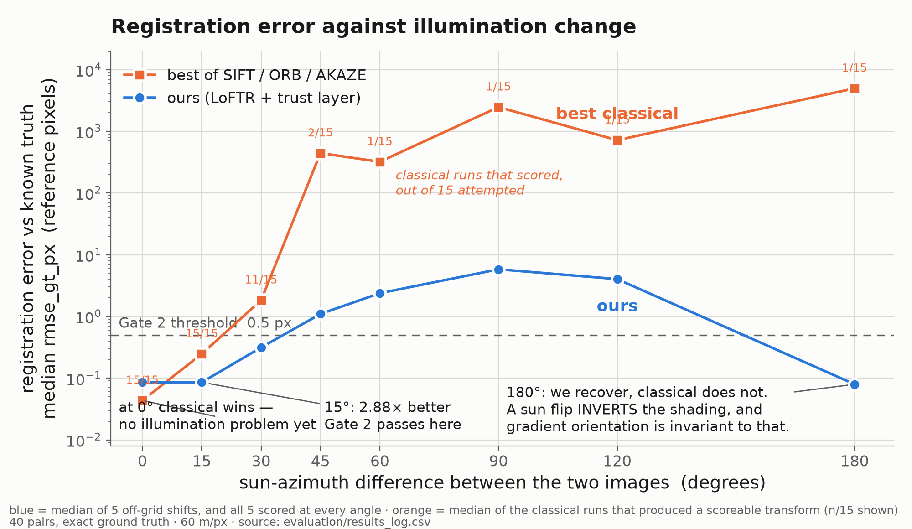

# SIH26166 — deck content, transcription-ready

> **Day 6, 4 Sep 2026.** Every figure here exists in `evaluation/results_log.csv` and is named
> with its row. Nothing is rounded in our favour and nothing is a placeholder except the portal
> metadata on slide 1, which only the SIH portal can supply.
>
> ## ✅ THE DECK IS BUILT — Day 6, 4 Sep 2026
>
> `presentation/SIH26166_deck.pptx` → `presentation/SIH26166_deck.pdf` (6 slides).
> Both are gitignored by rule and live locally / in Drive, not in history.
> Rebuild: `python -m presentation.make_figures && python -m presentation.build_deck`,
> then export to PDF (PowerPoint → Save as PDF, or `soffice --headless --convert-to pdf`).
>
> **Template acquired and verified.** Our guides said `sih.gov.in` 403s non-browser agents. It
> does not — it 403s the *default* user agent. With a normal browser UA it serves fine:
>
> ```
> curl -L -A "Mozilla/5.0 (Windows NT 10.0; Win64; x64) AppleWebKit/537.36 \
>   (KHTML, like Gecko) Chrome/128.0 Safari/537.36" \
>   -o presentation/sih_template.pptx \
>   "https://sih.gov.in/letters/2026/SIH2026-IDEA-Presentation-Format.pptx"
> ```
>
> **924,505 bytes, sha256 `ce3e5dee…` — matches the value in `CLAUDE.md` exactly.** 7 slides
> (6 + the instructions slide, which that slide itself says may be deleted).
>
> **What the official instructions slide requires, verbatim, and how the build honours it:**
> max 6 slides *including* the title page (we ship exactly 6) · *"avoid paragraphs, post your idea
> in points / diagrams / infographics / pictures"* (all bullets, two generated figures) ·
> *"only use provided template … without changing the idea details pointers"* (**the pointer text
> is never edited — not one character**; it is moved to the top and set small and grey, and our
> content goes in a new box below) · **"save the file in PDF and upload the same on portal. No PPT,
> Word Doc or any other format will be supported."**
>
> 🔴 **The submission is a PDF, not a `.pptx`.** That was not written down anywhere before Day 6.
>
> **Six slides including the title page ⇒ five content slides.** There is no "Problem Statement"
> slide and no "Proposed Solution" slide — *Proposed Solution* is the first bullet **prompt inside
> IDEA TITLE**.

---

## SLIDE 1 · TITLE PAGE

Metadata only. Copy from the portal, do not retype from memory.

| Field | Value |
|---|---|
| Problem Statement ID | **SIH26166** |
| Problem Statement Title | *Multi-modal, Sun angle and scale invariant image correspondence using Chandrayaan-2 optical images (OHRC, TMC and IIRS)* |
| Theme | Space Technology |
| PS Category | **Software** |
| Team ID | `[TBD — SIH portal]` |
| Team Name | `[TBD — as registered]` |

---

## SLIDE 2 · IDEA TITLE

*Prompts: Proposed Solution · Detailed explanation · How it addresses the problem · Innovation and uniqueness*

**Idea title:** *A lunar image-registration engine that knows when it is wrong.*

### Proposed Solution
A sensor-agnostic registration engine that aligns Chandrayaan-2 optical imagery to lunar reference
imagery to sub-pixel accuracy **and reports, cell by cell, where that alignment is trustworthy.**

### Detailed explanation
- Illumination normalisation → LoFTR dense matching → MAGSAC++ outlier rejection → sub-pixel NCC
  refinement → 8×8 spatial-distribution check.
- An **independent pixel-level check** re-derives the alignment without looking at any match, and
  the cells vote on the matcher's transform.
- Output is an aligned image, five metrics, and a **trust map**: *verified* / *weak* /
  *no evidence*. When the pixels contradict the matcher, the system **says so and switches method.**

### How it addresses the problem
The PS names three difficulties and we address each, on the axis it names:
- **Sun-angle invariance** — measured across a swept sun azimuth with exact ground truth.
- **Scale invariance** — common-GSD resampling. OHRC ~28 cm/px, TMC-2 ~5 m/px, IIRS ~80 m/px:
  **up to a 285× scale ratio between instruments on the same spacecraft.**
- **Sub-pixel accuracy + uniform distribution** — `rmse_gt_px`, `grid_coverage_fraction`,
  `distribution_cv`, logged on every run.

### Innovation and uniqueness — **lead with the finding, not the feature**

> **"The problem statement asks for RMSE, inlier count and inlier ratio. We implemented all three —
> and then found a reproducible case on real lunar data where the matcher still returns a
> confident consensus transform that the pixels flatly contradict. Match statistics describe the
> matches; they cannot see the ground. So we built the check that can — and we measured how often
> it works."**

> 🔴 **CORRECTED Day 6 — do not restore the earlier wording.** This bullet used to read *"all three
> look acceptable and the registration is 100% wrong."* **Our own logged row refutes that**: on
> `pair_04_tierD_native` the inlier count is **5** and the inlier ratio **0.057**, which look
> terrible, not acceptable. A judge asking "show me the inlier ratio you say looked fine" would have
> opened `results_log.csv` and falsified the project's single 25%-weighted novelty claim from its
> own evidence file. The finding is real; only that sentence was wrong.

- **The case** *(row `pair_04_tierD_native`, `ours_loftr+subpixel`)*: 88 correspondences, RANSAC
  returned a transform and reported `status ok`, and **0 of 35 measurable cells agree with it.**
  The system declared it **contradicted**, refused to use it, fell back to global correlation, and
  reported **231 m ± 216 m** — a declared failure with a number on it, instead of a confident wrong
  answer. *(The same row logs inlier count 5 and inlier ratio 0.057 — say those numbers yourself if
  asked; they are the evidence that this pair was hard, not evidence against us.)*
- **It is measured, not anecdotal** *(`reliability_calibration_pooled`, 8-delta)*: over 40 pairs
  and 2,560 cells with exact ground truth, failure detection is **77% at a 120 m threshold with a
  0% false-alarm rate** — across 27 correct registrations it never once cried wolf.
- **The trust label is calibrated** — inside the operating envelope (sun difference ≤ 30°), cells
  marked *verified* have median true error **0.123 px = 7.4 m at 60 m/px, 99.0% under half a
  pixel**, over 817 cells. **Figure: `figures/fig2_trust_calibration.png`** — the three states
  separate cleanly, which is what makes the map a measurement rather than a colour scheme.
- **Prior art, cited on the slide:** Uss et al. 2016 (per-region accuracy without ground truth);
  Brown & Lowe 2007 (match verification from inlier counts — **the test our failing case passes**);
  Wan et al. 2021 (correlation where features fail on optical↔DEM). **Ours** is the three-state
  semantics, the pixel-vs-match disagreement as the failure signal, and the calibration on lunar data.

> ⚠️ **Never claim as innovation:** illumination normalisation or common-GSD resampling — both are
> preprocessing in the PS-setters' own 2025 paper (arXiv 2509.04775, Space Applications Centre).
> Say them as engineering, with the citation.

---

## SLIDE 3 · TECHNICAL APPROACH

*Prompts: Technologies to be used · Methodology and process for implementation*

### Technologies
- **Matching:** LoFTR (detector-free transformer, **Apache-2.0**) · MAGSAC++ via `cv2.USAC_MAGSAC`
- **Preprocessing:** gradient-orientation / phase-congruency illumination normalisation; common-GSD resampling
- **Refinement:** sub-pixel NCC · 8×8 grid distribution check
- **Verification:** FFT cross-correlation area check (independent of the matcher)
- **Stack:** Python, OpenCV, PyTorch (CPU build), NumPy, Streamlit
- **Data:** Chandrayaan-2 OHRC · LROC NAC · Kaguya TC · LOLA elevation

### Methodology
```
input pair → common-GSD resample → illumination normalisation
           → LoFTR dense matching → MAGSAC++ outlier rejection
           → sub-pixel NCC refinement → 8×8 distribution check
           → INDEPENDENT AREA CHECK (pixels, not matches)
                 ├── agrees      → aligned output + trust map + 5 metrics
                 └── contradicted → declare, fall back to phase correlation,
                                    report uncertainty in metres
```

### Hardware — say this and only this
> **"Runs on a standard laptop, CPU only. No discrete GPU required."**

True, verifiable, and a genuine deployment virtue. **Do not name a GPU model.**

> **Rule for this slide: no unnamed technique.** ❌ "we use AI" → ✅ "LoFTR, a detector-free
> transformer matcher". ❌ "image processing" → ✅ "phase-congruency illumination normalisation".

---

## SLIDE 4 · FEASIBILITY AND VIABILITY

*Prompts: Analysis of feasibility · Potential challenges and risks · Strategies for overcoming them*

### Feasibility — it is built and measured, not proposed
- **Gate 2 passed on 4 Sep**, all six criteria, at a stated sun-azimuth difference of 15°
  *(medians over 5 off-grid shifts, `ours_loftr+subpixel`)*:

  | metric | required | measured |
  |---|---|---|
  | `rmse_gt_px` | < 0.5 | **0.0856** |
  | `inlier_ratio` | > 0.60 | **0.9774** |
  | `grid_coverage_fraction` | ≥ 0.80 | **1.0000** |
  | `distribution_cv` | < 1.0 | **0.4006** |
  | vs best classical, same pair same scale | ≥ 2× | **2.88×** |

- All data is **public and already downloaded**; all libraries are open-source; the pipeline runs
  on CPU on a laptop.
- **Licensing, and be specific:** LoFTR is **Apache-2.0**. We deliberately rejected SuperPoint —
  its pretrained weights are **academic / non-commercial research only**, which would block
  operational deployment. Kaguya TC data is **CC0**.

### Challenges and risks — stated by us, with numbers
- **Multi-modal (optical ↔ elevation) matching fails.** On our real Tier D pair the matcher is
  ~200 px wrong. **We detect it and fall back**, reporting 231 m ± 216 m rather than a wrong answer.
- **Our blind spot is the shoulder, 45°–60°.** At 60° the transform is **142.7 m** out and the
  contradiction flag does *not* fire. Named, not hidden.
- **At 0° sun difference classical beats us** — SIFT 0.044 px vs our 0.086 px. With identical
  illumination there is no illumination problem to solve. **Our advantage is illumination
  robustness, and it grows with the sun difference.**
- Shadow-dominated and extreme-incidence polar regions remain hard.

### Strategies
- Ship the **fallback and the uncertainty**, not a silent guess — the system degrades to a
  declared, quantified answer.
- **Report the whole curve**, including where it breaks, so the operating envelope is explicit.
- **Sensor-agnostic by design:** a new instrument is a metadata entry, not a rewrite.

---

## SLIDE 5 · IMPACT AND BENEFITS

*Prompts: Potential impact on the target audience · Benefits (social, economic, environmental)*

**Frame impact as what registration unlocks, not what registration is.**

### Impact
- **Landing-site characterisation.** Aligning high-resolution imagery across epochs and sensors is
  a prerequisite for hazard mapping — directly relevant to **LUPEX**, India's next lunar lander;
  CH-2 tasking has already shifted toward polar imaging for exactly this.
- **Change monitoring.** New impacts, and locating landed assets — **Chandrayaan-2's DFSAR imaged
  the Vikram lander after touchdown.** Real ISRO work, not a hypothetical.
- **More from data ISRO already owns.** 200+ OHRC images already sit in the archive. Registration
  turns individual strips into mosaics and time series. **No new spacecraft required.**
- **Sovereign tooling.** OHRC is the sharpest operational camera at the Moon — sharper than LROC
  NAC. Indian tooling for Indian data at the highest available resolution.

### Benefits
- **Trust as a deliverable.** An operator gets a per-region verdict, not one global number. A
  change-detection result inside a contradicted frame is **rejected, not reported** — on our Tier D
  pair the detector proposes **183 candidates and the gate keeps 0**: 5 rejected in weak cells,
  178 unassessable in no-evidence cells. **Not one survives into a report.**
- **Economic.** Open-source, permissively licensed, CPU-only — no GPU procurement, no licence cost,
  deployable on existing hardware.
- **Reusable.** The same engine works for Mars, or for Earth-observation cross-sensor registration.

### Future scope
DEM-assisted orthorectification · polar-region optimisation · onboard deployment.

---

## SLIDE 6 · RESEARCH AND REFERENCES

*Prompt: Details / links of reference and research work*

### Methods we build on
- **LoFTR** — Sun et al., CVPR 2021. Detector-free transformer matching. Apache-2.0.
- **MAGSAC++** — Barath et al., CVPR 2020. Marginalising sample consensus; `cv2.USAC_MAGSAC`.
- **Phase congruency** — Kovesi, 1999. Illumination-invariant feature representation.

### Prior art on reliability — the lineage of our claim
- **Uss, Vozel, Lukin, Chehdi**, *IEEE TGRS* 2016 (arXiv 1602.02720) — per-fragment registration
  accuracy estimated without ground truth.
- **Brown & Lowe**, *IJCV* 2007 — probabilistic match verification from inlier counts.
  **This is the test our failing Tier D case passes while being 100% wrong.**
- **Wan, Shao, Li**, arXiv 2106.12738, 2021 — correlation where features fail on optical ↔ DEM;
  SIFT fails in five of nine of their cases.
- **Truong et al.**, CVPR 2021, PDC-Net — dense correspondence with pixel-wise confidence.

### Lunar-domain context
- **Singla, Patel, Dube et al. (Space Applications Centre)**, arXiv 2509.04775, 2025 — comparative
  evaluation of traditional and deep feature matching on Chandrayaan-2. ⚠️ **It benchmarks
  SuperGlue, not LoFTR.**
- **Xie, Liu, Di et al.**, *Remote Sensing* 17(13):2302, 2025 — MiLOI, 321 multi-illumination LROC
  NAC pairs.
- **Wagner et al.**, LPSC 2022 #2573 / PSJ 2024 — LROC south-polar controlled mosaic.

### Data sources and licences — provenance is a maturity signal
| Source | Product | Licence |
|---|---|---|
| ISRO PRADAN / archive.org | Chandrayaan-2 OHRC | ISRO open data |
| NASA PDS Imaging | LROC NAC | Public domain |
| JAXA / AWS Astrogeo | Kaguya TC | **CC0-1.0** |
| NASA PDS Geosciences | LOLA elevation | Public domain |

Full evidence ledger: `ops/PHASE0_RESEARCH_DAY5.md` · every measurement:
`evaluation/results_log.csv`.

---

## The 20-second moment — **this is `figures/fig1_sun_angle_vs_error.png`**



Regenerate with `python -m presentation.make_figures` — it reads `results_log.csv` at run time,
so the picture cannot drift from the evidence. **If a figure and a slide disagree, re-run it;
never edit the picture.**


**Past 30° of sun difference, classical methods mostly return no answer at all. We keep working,
and where we stop being right we say so.** Same pairs, byte-identical files:

| Δ sun azimuth | classical runs that scored | best classical | ours (scored 5/5) | |
|---|---|---|---|---|
| 0° | 15 / 15 | **0.044** | 0.086 | *classical wins — no illumination problem to solve* |
| 15° | 15 / 15 | 0.247 | **0.086** | **2.88×** — the gate |
| 30° | 11 / 15 | 1.833 | **0.314** | 5.84× |
| 90° | **1 / 15** | 2465 | **5.805** | classical has all but stopped working |
| **180°** | **1 / 15** | 4972 | **0.080** | **we are back to sub-pixel; classical is not** |

> ⚠️ **Say the success rate, not the ratio.** *"At 180°, fourteen of fifteen classical runs failed
> outright — no transform to score. The one that scored was 4,972 px wrong. We scored five of five,
> at 0.080 px."* The 62,519× ratio is arithmetically true but rests on that single surviving run,
> and quoting it invites a sample-size question the success rate simply does not have.
> **This was mislabelled as a "median of 5" until an audit on Day 6 — do not reintroduce it.**

**Why 180° is our *easiest* hard case, not our hardest:** a 180° azimuth flip **inverts** the
shading, and gradient-orientation normalisation is invariant to contrast inversion. At 90° the
shading **rotates**, which no invariance covers — so 90° is the failure peak. **The hard axis is
orthogonality, not magnitude.** Classical detectors do *not* recover at 180°, which is what proves
the recovery comes from our illumination normalisation and not from the renderer.

---

## Numbers audit — every figure above, and its row

| Figure | Row / file |
|---|---|
| 0.0856 px, 0.9774, 1.0000, 0.4006 @ 15° | `results_log.csv`, `ours_loftr+subpixel`, `d_azimuth=15deg` |
| 2.88× vs classical | `results_log.csv`, methods `SIFT`/`ORB`/`AKAZE`, notes `GATE 2 CRITERION 5` |
| 0.044 px SIFT @ 0° (5/5 runs), 4,972 px SIFT @ 180° (**1 of 5 runs**; 14/15 classical runs failed) | same — check `status` on every classical row before quoting a median |
| 0.123 px / 99.0% / 817 cells | `reliability_calibration_envelope` (logged 5 Sep; derivation `core/reliability_calibration.csv`) |
| 77% detection, 0% false alarms @ 120 m | `ops/MOVE2_FAILURE_DETECTION_DAY6.md` §3, from `core/reliability_calibration.csv` |
| 88 matches, 0 of 35 cells, 231 m ± 216 m | `pair_04_tierD_native`, `ours_loftr+subpixel` + `fft_phase_correlation (fallback)` |
| 142.7 m undetected @ 60° | `ops/MOVE2_FAILURE_DETECTION_DAY6.md` §4 |
| 183 candidates, 0 kept / 5 rejected / 178 unassessable | `change_detection_absdiff+reliability_gate`, 4 Sep |
| 285× scale ratio | `docs/00_CANONICAL_FACTS.md` §1 |

**Banned from every slide** (Invariant 2): the words *cross-sensor* and *multi-modal* for anything
but genuinely different instruments / modalities; any comparison against classical methods **on
real lunar data** (our comparison is on synthetic pairs with exact ground truth, and that is
stated); any claim that Tier A, Tier B or Tier C data was ever cut. It was not.
